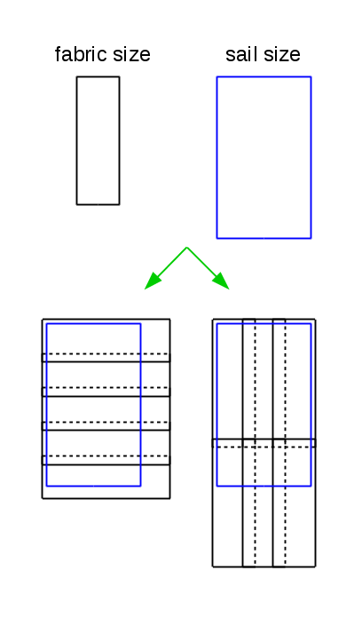

## Sails

The task is to create a program that calculates the amount of fabric needed to make a sail.

We assume that we have fabric available for making sails. The fabric is supplied in the form of rectangles of given dimensions (height, width). We also receive information about the required size of the sail. The sail is rectangular, specified by its height and width. The program determines how many pieces of fabric need to be sewn together to create a sail of the desired size.

The complexity of the program is increased by the fact that the fabric must overlap at the seams. Therefore, after loading the sizes of the fabric and the sail, the program determines whether it will be necessary to sew the fabric. If so, it asks for the desired size of the overlap.

When sewing, we assume that rectangular pieces of fabric are always laid out in the same orientation in a rectangular grid. That is, the rectangles are either all kept in the given orientation or all rotated by 90 degrees. We also assume that any leftover pieces of fabric cannot be reused.



The program's input is:

- Fabric dimensions - width and height, decimal numbers,
- Required sail dimensions - height and width, decimal numbers, and
- Size of the overlap at the seam (decimal number). The program only asks for this information if it is necessary to sew the fabric.

The output of the program is the smallest number of pieces of fabric needed to make the sail. For some combinations of inputs, it may not be possible to make the sail, and the program will display this (see example).

If the input is invalid, the program must detect this and display an error message. Display the error message on the standard output (not on the error output). Consider it an error if:

- The height, width, or size of the overlap is non-numeric,
- The height or width is negative or zero,
- The size of the overlap is negative (zero overlap is allowed),
- Missing input for height or width,
- Missing input for overlap (in cases where overlap information is necessary).

Sample program operation:
```plaintext
Fabric size:
2.5 3
Sail size:
12 5
Overlap:
0
Number of fabric pieces: 8
Fabric size:
2.5 3
Sail size:
12 5
Overlap:
0.2
Number of fabric pieces: 12
Fabric size:
4 3
Sail size:
5 4
Overlap:
0.1
Number of fabric pieces: 2
Fabric size:
3 4
Sail size:
2 2
Number of fabric pieces: 1
Fabric size:
1e100 1e100
Sail size:
3e100 3e100
Overlap:
1e99
Number of fabric pieces: 16
Fabric size:
0.71 1
Sail size:
4.91 1.7
Overlap:
0.01
Number of fabric pieces: 14
Fabric size:
2 2
Sail size:
5 1
Overlap:
1.5
Number of fabric pieces: 7
Fabric size:
2 1
Sail size:
5 1
Overlap:
1.5
Number of fabric pieces: 7
Fabric size:
1 1
Sail size:
5 1
Overlap:
1.5
Cannot be made.
Fabric size:
3 abcd
Invalid input.
Fabric size:
-5 1
Invalid input.
```

Notes:
Sample runs capture the expected outputs of your program (bold text) and the inputs provided by the user (regular font). Bold highlighting is used here on the assignment page only to make the output more readable. Your program is only required to display text without highlighting (without HTML markup).
The newline character (\n) is also present after the last line of output (even after any error message).
Use double precision floating point numbers to represent values. Do not use the float type, as its accuracy may not be sufficient.
The task can be solved without using functions. However, if you use functions correctly, the program will be clearer and easier to debug.
Numeric input values are given so that they fit within the range of the double data type; the result fits within the range of the int data type.
When programming, pay attention to the exact form of the outputs. The output of your program is checked by a machine, which requires an exact match with the reference outputs. Any discrepancy, even a missing or extra space/newline, is considered an error. To quickly eliminate these problems, use the attached archive with a set of input and expected output data. Look at the video tutorial (courses -> video tutorials) on how to use the testing data and how to automate testing.
Your program will be run in a restricted testing environment. It is limited by runtime (the limit is visible in the log of the reference solution) and also by the size of the available memory (but this task should not have a problem with either limitation). The testing environment also prohibits the use of some "dangerous functions" -- functions for running a program, working with the network, etc. If these functions are used, the program will not start. You may use the following call in your program:

```c
int main ( int argc, char * argv [] )
{
   
    ...
       
    system ( "pause" ); /* so the program window does not close */
    return 0;
}
```

This will not work in the testing environment - running another program is prohibited. (Even if the program started, it would be rejected. There would be no one to "unpause" it, the program would wait indefinitely and thus exceed the maximum runtime.) So, if you want to keep the pause for testing on your computer and at the same time ensure that the program will run correctly, use the following trick:


```c
int main ( int argc, char * argv [] )
{
   
    ...
  
#ifndef __PROGTEST__
    system ( "pause" ); /* this is not seen by progtest */
#endif /* __PROGTEST__ */
    return 0;
}
```