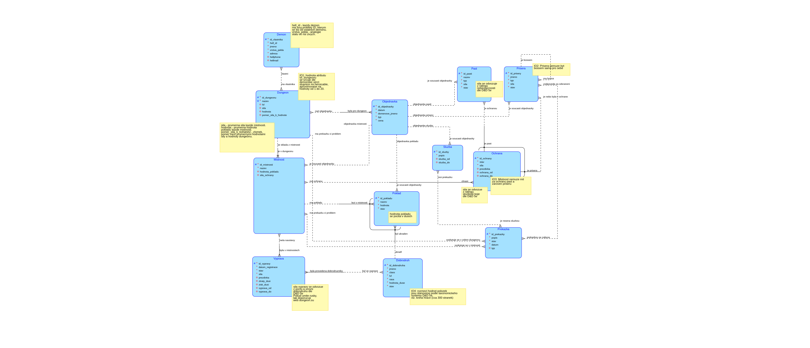
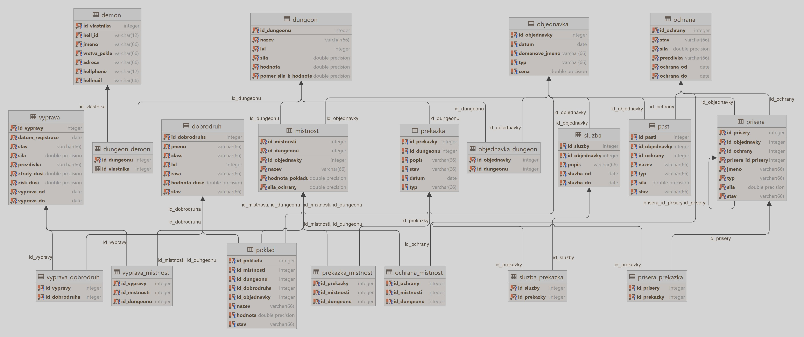

# Soul Farm Database

## Description

In one of the nine layers of hell lives an old demon who runs his soul business in the material realm of the living. He
owns a dungeon that lures reckless adventurers with the promise of treasure, carefully guarded by devoted monsters in
the far corners of the dark and ancient underground complex.

A substantial household has recently brought in a considerable harvest. After a significant upgrade to his dungeon, the
old demon could no longer keep track of everything happening there, so he decided to establish a convenient database to
not only record everything but also increase the success and profitability of his business and ensure a better future
for his children.

The main source of income comes from visits by brave adventurers. The famous (i.e., cursed!) demon wants to record each
visit, how many adventurers came, their class, level, race (the value of the soul depends on this!!!), type of death (
whether the goddess of luck smiled at them or us, which according to the latest statistics, she almost always does). If
the adventurer survived, we must record if they carried any treasure with them, which we must then buy back. But more on
that later.

The dungeon consists of various rooms connected to each other, forming a massive (or small, depending on how
successfully you kill people) complex. Each room may contain some treasure, which has its value in souls (surely you
already knew that souls are a very valuable currency in hell). Rooms are also guarded by monsters. These must also be
distinguished (the old demon is a connoisseur and likes a lot of different kinds of monsters). So, each monster has its
type (skeleton, dragon, slime, beholder, etc.), strength, identifier, possibly a name. Monsters also have their
hierarchy and bosses (superiors), and are assigned which room they must guard. Or they don't have to, because a vigilant
and faithful hellhound does it instead.

Returning to our treasures. It's clear that this business carries some risks (even for us). Cursed (i.e., famous!)
adventurers steal treasure, kill monsters, cause disruptions and other vandalism. Moreover, it's an ordinary household,
where other obstacles may appear (an old statue collapses, a frail skeleton loses a favorite bone, or a clumsy slime
gets stuck in the toilet). The list of all obstacles should describe the type and the room where the problem occurred.

All these soul losses need to be somehow repaired. How? Thank God (i.e., Cursed Devil!), we have Hellnet! From the
comfort of home, we can shop from each of the nine layers of hell! You can buy almost anything, and the old demon wants
to record each purchase by type, price, and website. For example, at www.yourdungeon.hell, we can buy a new statue, a
replacement bone, or some treasure that will attract more adventurers. At www.9hell.hell, we can acquire services and
order either some quest for our dungeon or spread rumors of a bottomless treasure. For any monster or trap, a few clicks
take us to www.deadheroes.dead, where we can get a new dragon, fresh zombie, or a sexual succubus (either for our own
satisfaction or to charm a lustful adventurer and lure him into the intimate-romantic atmosphere of our dungeon, where
heavenly pleasure surely awaits him).

The last thing we want to record is the total value of treasures and the total strength of monsters in the entire
dungeon, and some ratio between these two values. This is important because the value of the treasure attracts
increasingly higher-level adventurers, and therefore we must maintain the correct ratio so our loyal employees can cope
with it.

List of entities:

- **room**: name, connected room, treasure, protection
- **treasure**: name, room, value
- **adventurer**: id, name, class, level, race, soul strength, strength, status, loot
- **monster**: name/nickname, strength, room, boss
- **visit**: date, id, adventurers, gains, losses
- **trap**: id, type, strength
- **obstacle**: type, cause
- **purchase**: id, date, price, domain, type, description
- **service**: id, provider, type, description
- **dungeon**: name, owner, total treasure, total strength, treasure/strength ratio



(for the diagram above it is recommended to use light theme, or skip it and go to the next diagram)



[data.json](data.json) - visualization in json data format (usable only on intranet dbs portal).
[model.json](model.json) - visualization in json model format (usable only on intranet dbs portal).

## Loops Discussion

Below is a list of loops including explanations of potential issues.

**Purchase loops:** We have many such loops that are tied to the purchase of rooms, traps, monsters, services, and
treasures. Since each of these entities is always associated with a room, they are automatically associated with the
dungeon in which the order was placed (since we do not exclude larger businesses from multiple dungeons, we want to know
directly to which dungeon the purchase belongs, which creates this tangle of loops).

**Loop dungeon-order-room-dungeon:** This involves the purchase of rooms that form the dungeon in which the room was
purchased through the order. Multiple rooms can be purchased in one order, but not one room in multiple purchases. The
shortest loop representing a purchase.

**Loop dungeon-order-(trap | monster)-protection-room-dungeon:** There are two almost identical loops. The purchase
process is the same as for rooms, but the purchased trap or monster can participate in the protection of one or more
rooms according to their job or preference (job and preference apply more to monsters, unless you have a livelier trap).
And therefore, automatically also to the dungeon to which it was purchased.

**Loop dungeon-order-treasure-room-dungeon:** Same process - we buy treasures and place them in some rooms. One treasure
can be in exactly one room. This can be another loop dungeon-order-treasure-adventurer-expedition-room-dungeon. The
difference is that the treasure is either in our hands or in the dirty hands of adventurers who stole the treasure in
our dungeon during the expedition. In this case, thanks to the XOR relationship, it is forbidden for the treasure to be
stolen by the adventurer and at the same time be in our dungeon, so we have either one or the other loop. The loop
room-treasure-adventurer-expedition-room itself cannot occur due to XOR.

**Loop dungeon-order-service-obstacle-(room-dungeon | dungeon):** This loop does not always have to be present because
the service can be simple and not connected to any obstacle at all (e.g., pizza delivery). But it can also address some
local obstacle (like hungry vampires), or global in the entire dungeon (like mass hunger - need for more pizza, possibly
with Blood-Blood Zero if you have many vampires). It can also be external and not form a loop with the dungeon, for
example, we want to advertise our dungeon by sending monsters to nearby villages to convince the locals how unique and
remarkable our dungeon is.

**Loop monster-monster:** Just like in life, there must be some manager that the customer can address, so our dungeon
should have bosses who would kindly serve the potential adventurer and take care of their soul. The answer to the
ethical question, can a boss be his own boss, is integrity constraint number two (no, he can't). Specifically, a monster
can have one boss and at the same time be the boss of several subordinate monsters.

**Loop dungeon-order-monster-obstacle-(room-dungeon | dungeon):** A newly purchased monster can be immediately honored
to solve one or more obstacles. In such a case, another comrade of hers can help her work together on an important task,
so more monsters can solve one obstacle. The obstacle can thus be connected to a room or the entire dungeon, and thus
through the purchase form a loop with the monster.

**Loop dungeon-obstacle-room-dungeon:** This loop can occur when we have an obstacle in multiple rooms that are
connected to the dungeon entity. Since we know which dungeon the room with the obstacle belongs to, direct connection
dungeon-obstacle might seem like unnecessary information, but it basically doesn't matter, because this loop is not
mandatory, and moreover, it will be even better, as we can filter obstacles first by dungeon, and then go through
individual rooms.

**Loop obstacle-monster-service-obstacle:** This loop occurs purely formally, as we can buy a monster and a service and
they can have a common order entity. Again, this should not matter at all.

## Scripts:

[create_script.sql](create_script.sql) - script to reset and create database.

[insert_script.sql](insert_script.sql) - script to insert data into database.

## Queries:

### 1. Adventurers who survived the dungeon twice or more.

```sql
SELECT DISTINCT d.*
FROM dobrodruh d
         NATURAL JOIN
     ( -- !!! tady je defacto ten count tady radek nize zbytecny. Radeji vypsat pouze id_dobrodruha
         SELECT COUNT(jmeno), jmeno, id_dobrodruha
         FROM (SELECT d.* -- tady by asi distinct nemel byt
               FROM dobrodruh d
                        NATURAL JOIN vyprava_dobrodruh
                        JOIN vyprava v USING (id_vypravy)
               WHERE d.stav != 'Dead' AND v.stav = 'Finished') R1
         GROUP BY (jmeno, id_dobrodruha)
         HAVING COUNT(jmeno) >= 2) R2 -- tady je potreba mit nekde mit distinct? Nevim - zkontroluj to priste az sem kouknes
ORDER BY (lvl) DESC
```

### 2. The strongest monster in the entire history of the dungeon that protected one of these rooms: Starry Cavern, Great Cavern, or Dark Pool.

```sql

SELECT jmeno, typ, sila, stav
FROM (SELECT DISTINCT p.*
      FROM prisera p
               JOIN ochrana_mistnost o_m USING (id_ochrany)
               JOIN mistnost m USING (id_mistnosti)
      WHERE m.nazev IN ('Starry Cavern', 'Great Cavern', 'Dark Pool')) R3
         NATURAL JOIN
     (SELECT MAX(sila) AS SILA
      FROM (SELECT DISTINCT p.*
            FROM prisera p
                     JOIN ochrana_mistnost o_m USING (id_ochrany)
                     JOIN mistnost m USING (id_mistnosti)
            WHERE m.nazev IN ('Starry Cavern', 'Great Cavern', 'Dark Pool')) R1) R2
```

### 3. The weakest monster that survived the most visits in the entire history of the dungeon.

```sql
SELECT DISTINCT R5.*
FROM (SELECT DISTINCT p.*
      FROM (SELECT m.*
            FROM (SELECT DISTINCT id_mistnosti, COUNT(id_vypravy)
                  FROM mistnost m
                           NATURAL JOIN vyprava_mistnost v_m
                           JOIN ochrana_mistnost USING (id_mistnosti)
                  GROUP BY (id_mistnosti)) R1 -- pocet vyprav v kazde ochranovane mistnosti a id prislusne mistnosti
                     JOIN
                 (SELECT DISTINCT MAX(count)
                  FROM (SELECT DISTINCT id_mistnosti, COUNT(id_vypravy)
                        FROM mistnost m
                                 NATURAL JOIN vyprava_mistnost v_m
                                 JOIN ochrana_mistnost USING (id_mistnosti)
                        GROUP BY (id_mistnosti)
                        ORDER BY count DESC) R1) R2 -- maximalni hodnota vyprav ze vsech takovych mistnosti
                 ON (count = max)
                     NATURAL JOIN mistnost m) R4 -- ochranovane mistnosti, kde pocet vyprav byl maximalni za celou historii dungeonu
               JOIN ochrana_mistnost USING (id_mistnosti)
               JOIN prisera p USING (id_ochrany)
      WHERE stav != 'Lost in battle') R5 -- vsechny monstry ktere ochranovaly mistnosti, kde bylo nejvic vyprav za celou historii dungeonu, a ktere to prezili
         JOIN
     (SELECT DISTINCT min(p.sila)
      FROM (SELECT m.*
            FROM (SELECT DISTINCT id_mistnosti, COUNT(id_vypravy)
                  FROM mistnost m
                           NATURAL JOIN vyprava_mistnost v_m
                           JOIN ochrana_mistnost USING (id_mistnosti)
                  GROUP BY (id_mistnosti)) R1 -- pocet vyprav v kazde ochranovane mistnosti a id prislusne mistnosti
                     JOIN
                 (SELECT DISTINCT MAX(count)
                  FROM (SELECT DISTINCT id_mistnosti, COUNT(id_vypravy)
                        FROM mistnost m
                                 NATURAL JOIN vyprava_mistnost v_m
                                 JOIN ochrana_mistnost USING (id_mistnosti)
                        GROUP BY (id_mistnosti)
                        ORDER BY count DESC) R1) R2 -- maximalni hodnota vyprav ze vsech takovych mistnosti
                 ON (count = max)
                     NATURAL JOIN mistnost m) R4 -- ochranovane mistnosti, kde pocet vyprav byl maximalni za celou historii dungeonu
               JOIN ochrana_mistnost USING (id_mistnosti)
               JOIN prisera p USING (id_ochrany)
      WHERE stav != 'Lost in battle') R6 -- minimalni sila ze vsech monstru, ktere ochranovaly mistnosti, kde bylo nejvic vyprav za celou historii dungeonu, a ktere to prezili
     ON (min = sila)

``` 

### 4. An obstacle that had no responsible monster.

Relational Algebra:

```relational algebra
prisera_prekazka![prisera_prekazka.id_prekazky = prekazka.id_prekazky >prekazka
```

SQL:

```sql
SELECT DISTINCT *
FROM prekazka p
WHERE NOT EXISTS (SELECT *
                  FROM prisera_prekazka p_p
                  WHERE p_p.id_prekazky = p.id_prekazky);

```

### 5. Names, strength, type, and status of monsters that protect (have status 'active' or 'pretending dead') the rooms Great Cavern and also Starry Cavern.

Relational Algebra:

```relational algebra
{mistnost(nazev = 'Great Cavern' ∨ nazev = 'Starry Cavern' )*>ochrana_mistnost*>prisera}(stav = 'active' ∨ stav = 'pretending dead' )[jmeno, typ, sila, stav]
```

SQL:

```sql
SELECT DISTINCT p.jmeno, p.typ, p.sila, p.stav
FROM prisera p
         JOIN ochrana o USING (id_ochrany)
         NATURAL JOIN ochrana_mistnost
         JOIN mistnost m USING (id_mistnosti)
WHERE (m.nazev = 'Great Cavern' OR m.nazev = 'Starry Cavern')
  AND (p.stav = 'active' OR p.stav = 'pretending dead');

```

### 6. An expedition that had only adventurers with the class 'Fighter'.

Relational Algebra:

```relational algebra
{<!-- -->{dobrodruh(class = 'Fighter')*vyprava_dobrodruh}[id_vypravy]
\
{dobrodruh(class != 'Fighter')*vyprava_dobrodruh}[id_vypravy]} * vyprava
```

SQL:

```sql
SELECT *
FROM vyprava
         NATURAL JOIN
     (SELECT DISTINCT id_vypravy
      FROM vyprava_dobrodruh v_d
               NATURAL JOIN dobrodruh d
      WHERE class = 'Fighter'
      EXCEPT
      SELECT DISTINCT id_vypravy
      FROM vyprava_dobrodruh v_d
               NATURAL JOIN dobrodruh d
      WHERE class != 'Fighter') R2;
```

### 7. A treasure that was in an order with a price of over 166 souls (note, this is not the value of the treasure!) and is not stolen (does not have the status 'Stolen').

Relational Algebra:

```relational algebra
objednavka(cena >= 166 )*>poklad(stav != 'Stolen')
```

SQL:

```sql
SELECT DISTINCT p.*
FROM objednavka o
         CROSS JOIN poklad p
WHERE o.cena >= 166
  AND o.id_objednavky = p.id_objednavky
  AND p.stav != 'Stolen';

SELECT DISTINCT p.*
FROM poklad p
WHERE EXISTS (SELECT *
              FROM objednavka o
              WHERE o.cena >= 166
                AND o.id_objednavky = p.id_objednavky
                AND p.stav != 'Stolen');

SELECT DISTINCT p.*
FROM poklad p
WHERE p.stav != 'Stolen' AND p.id_objednavky IN ( 
    SELECT DISTINCT id_objednavky
    FROM objednavka
    WHERE cena >= 166 
    );
```

### 8. An adventurer who did not steal any of the same type of treasure. By the way, what did they steal?

```sql
SELECT *
FROM dobrodruh d
         JOIN poklad p USING (id_dobrodruha)
         NATURAL JOIN
     (SELECT id_dobrodruha
      FROM dobrodruh d
               JOIN poklad p USING (id_dobrodruha)
      EXCEPT
      SELECT DISTINCT *
      FROM (SELECT id_dobrodruha
            FROM dobrodruh d
                     JOIN poklad p USING (id_dobrodruha)
            GROUP BY (id_dobrodruha, nazev)
            HAVING COUNT(nazev) > 1
            UNION
            SELECT id_dobrodruha
            FROM dobrodruh d
                     JOIN poklad p USING (id_dobrodruha)
            GROUP BY (id_dobrodruha)
            HAVING COUNT(id_dobrodruha) = 1) R1) R2;
```

### 9. List the average strength of all protections in the dungeon, as well as the minimum and maximum strength.

```sql
SELECT MIN(sila) AS sila_minimum, AVG(sila) AS sila_prumer, MAX(sila) AS sila_maximum
FROM ochrana
```

### 10. Rooms that were reached by every expedition with the status 'Finished'.

Relational Algebra:

```relational algebra
{vyprava_mistnost[id_mistnosti,id_vypravy]÷vyprava(stav='Finished')[id_vypravy]}*mistnost
```

SQL:

```sql
SELECT DISTINCT *
FROM mistnost m
WHERE NOT EXISTS(SELECT 'Ahoj'
                 FROM vyprava v
                 WHERE v.stav = 'Finished'
                   AND NOT EXISTS(SELECT 'DBS'
                                  FROM vyprava_mistnost m_v
                                  WHERE m_v.id_mistnosti = m.id_mistnosti
                                    AND m_v.id_vypravy = v.id_vypravy));
```

### 11. Query Result Test for Query 10, Category D: Rooms Reached by Every Expedition with Status 'Finished'. The query returns room IDs 1 and 3. For each of these rooms, we will find all expeditions that reached them and subtract this from all expeditions with status 'Finished'. The result should be an empty set.

```sql
SELECT id_mistnosti,
       COUNT(DISTINCT id_vypravy) -- DISTINCT zajisti, ze se nezapoctou stejne vypravy, ktere se treba opakovaly (v tomto pripade jsou zadne takove)
FROM mistnost
         JOIN vyprava_mistnost USING (id_mistnosti)
WHERE id_mistnosti in ( -- puvodni dotaz D
    SELECT DISTINCT m.id_mistnosti
    FROM mistnost m
    WHERE NOT EXISTS(SELECT 'Ahoj'
                     FROM vyprava v
                     WHERE v.stav = 'Finished'
                       AND NOT EXISTS(SELECT 'DBS'
                                      FROM vyprava_mistnost m_v
                                      WHERE m_v.id_mistnosti = m.id_mistnosti
                                        AND m_v.id_vypravy = v.id_vypravy)))
GROUP BY (id_mistnosti)
HAVING COUNT(DISTINCT id_vypravy) != (SELECT COUNT(*) 
                                       FROM vyprava
                                       WHERE stav = 'Finished');


-- variant rucni kontroly
-- (SELECT DISTINCT *
-- FROM vyprava v
-- WHERE v.stav = 'Finished'
-- EXCEPT
-- SELECT DISTINCT v.*
-- FROM mistnost m JOIN vyprava_mistnost v_m USING (id_mistnosti) JOIN vyprava v USING(id_vypravy)
-- WHERE m.id_mistnosti = 1
-- )

-- UNION

-- (SELECT DISTINCT *
-- FROM vyprava v
-- WHERE v.stav = 'Finished'
-- EXCEPT
-- SELECT DISTINCT v.*
-- FROM mistnost m JOIN vyprava_mistnost v_m USING (id_mistnosti) JOIN vyprava v USING(id_vypravy)
-- WHERE m.id_mistnosti = 3
-- )
```

### 12. A monster that is not in any protection and does not have the status 'business trip'.

Relational Algebra:

```relational algebra
{ochrana![ochrana.id_ochrany = prisera.id_ochrany>prisera}(stav != 'buisiness trip')
```

SQL:

```sql
SELECT DISTINCT *
FROM prisera p
WHERE stav != 'buisiness trip' AND NOT EXISTS (
    SELECT 'TEST PROGTEST TEST'
    FROM ochrana o
    WHERE o.id_ochrany = p.id_ochrany
);

```

### 13. All types and prices of orders with a price under 66 souls, in which no room, monster, trap, or service was purchased, sorted in descending order by price and then ascending order by type.

```sql
SELECT DISTINCT typ, cena
FROM (SELECT DISTINCT o.*
      FROM objednavka o
      EXCEPT
      (SELECT DISTINCT o.*
       FROM objednavka o
                JOIN prisera p USING (id_objednavky)
       UNION
       SELECT DISTINCT o.*
       FROM objednavka o
                JOIN past p USING (id_objednavky)
       UNION
       SELECT DISTINCT o.*
       FROM objednavka o
                JOIN mistnost m USING (id_objednavky)
       UNION
       SELECT DISTINCT o.*
       FROM objednavka o
                JOIN sluzba s USING (id_objednavky)
       UNION
       SELECT DISTINCT o.*
       FROM objednavka o
                JOIN poklad p USING (id_objednavky))) R1
ORDER BY cena DESC, typ ASC
```

### 14. Monsters with strength greater than or equal to 0.5 and less than or equal to 4, that were never ordered or are not in any protection.

Relational Algebra:

```relational algebra
{<!-- -->{prisera!<prisera.id_objednavky = objednavka.id_objednavky]objednavka}
∪
{prisera!<prisera.id_ochrany = ochrana.id_ochrany]ochrana}}(sila >= 0.5 ∧ sila <= 4)
```

SQL:

```sql
SELECT DISTINCT *
FROM (SELECT DISTINCT *
      FROM prisera p
      WHERE NOT EXISTS (SELECT DISTINCT 'Hello World!'
                        FROM objednavka o
                        WHERE p.id_objednavky = o.id_objednavky)
      UNION
      SELECT DISTINCT *
      FROM prisera p
      WHERE NOT EXISTS (SELECT DISTINCT *
                        FROM ochrana o
                        WHERE p.id_ochrany = o.id_ochrany)) R1
WHERE sila >= 0.5
  AND sila <= 4;
```

### 15. An adventurer who stole some treasure and was also in an expedition with strength greater than 14.

Relational Algebra:

```relational algebra
{<!-- -->{vyprava(sila>14)*vyprava_dobrodruh}[id_dobrodruha]*dobrodruh}
∩
{poklad[id_dobrodruha]*>dobrodruh}
```

```sql
SELECT DISTINCT d.*
FROM dobrodruh d
         JOIN vyprava_dobrodruh USING (id_dobrodruha)
         JOIN vyprava v USING (id_vypravy)
WHERE v.sila > 14
INTERSECT
SELECT DISTINCT d.*
FROM dobrodruh d
         JOIN poklad p USING (id_dobrodruha)
```

### 16. How many different arrangements of each protection with strength 2 and above exist for each room in the dungeon? How many different protections will be used? How many rooms will be protected?

```sql
SELECT COUNT(*)                              AS pocet_ruznych_variant_ochrany_mistnosti,
       COUNT(DISTINCT ochrana.id_ochrany)    AS pocet_ochran,
       COUNT(DISTINCT mistnost.id_mistnosti) AS pocet_mistnosti
FROM mistnost
         CROSS JOIN ochrana;
-- agregacni funkce agregue skupinu dat do jednoho vystupu. 
-- v tomto pripade to agregue cele radky do jednoho vystupu count
```

### 17. A room that had some protection or some obstacle, but never had both protection and obstacle at the same time.

Relational Algebra:

```relational algebra
{<!-- -->{mistnost<*ochrana_mistnost}
∪
{mistnost<*prekazka_mistnost}}
\
{<!-- -->{mistnost<*ochrana_mistnost}
∩
{mistnost<*prekazka_mistnost}}
```

SQL:

```sql
(SELECT DISTINCT m.*
 FROM mistnost m
          NATURAL JOIN ochrana_mistnost
 UNION
 SELECT DISTINCT m.*
 FROM mistnost m
          NATURAL JOIN prekazka_mistnost)
EXCEPT
(SELECT DISTINCT m.*
 FROM mistnost m
          NATURAL JOIN ochrana_mistnost
 INTERSECT
 SELECT DISTINCT m.*
 FROM mistnost m
          NATURAL JOIN prekazka_mistnost)
```

### 18. All adventurers who do not have the class 'Fighter', 'Barbarian', 'Priest', 'Paladin', or 'Mage'; but have a level 2 or higher.

```sql
SELECT DISTINCT *
FROM dobrodruh
WHERE class NOT IN ('Fighter', 'Barbarian', 'Priest', 'Paladin', 'Mage')
  AND lvl > 1

```

### 19. List all rooms and all their protection records. List all rooms without any protection.

```sql
BEGIN; -- zacatek transakce

INSERT INTO mistnost
VALUES (15, 1, null, 'Temple of Dumatoyn', null, null);
-- docasne pridam zaznam
-- VSECHNY
SELECT DISTINCT *
FROM ochrana_mistnost o_m
         JOIN ochrana o USING (id_ochrany)
         RIGHT JOIN mistnost m USING (id_mistnosti)
ORDER BY id_mistnosti;

-- BEZ OCHRANY
SELECT DISTINCT *
FROM ochrana_mistnost o_m
         JOIN ochrana o USING (id_ochrany)
         RIGHT JOIN mistnost m USING (id_mistnosti)
WHERE id_ochrany IS NULL
ORDER BY id_mistnosti;

ROLLBACK; -- vrati zpet do puvodniho stavu - je treba mit begin!
```

### 20. All monsters that have some subordinate monsters and are not in the status 'Lost in battle'.

Relational Algebra:

```relational algebra
prisera[id_prisery]*prisera[prisera_id_prisery->id_prisery]*prisera(stav != 'Lost in battle')
```

```sql
SELECT DISTINCT p1.*
FROM prisera p1
         JOIN prisera p2 ON (p1.id_prisery = p2.prisera_id_prisery)
WHERE p1.stav != 'Lost in battle'
```

### 21. The maximum damage caused by treasure theft in the entire history of the dungeon.

```sql
SELECT SUM(hodnota) AS celkove_ztraty_v_dusich
FROM poklad
WHERE id_dobrodruha IS NOT NULL

```

### 22. List all protections and their records of the room they protected, where the room is either 'Cave Entrance' or 'Dark Pool'.

```sql
SELECT DISTINCT o.id_ochrany, COALESCE(nazev, 'Nechranili tyto mistnosti'), stav, sila, prezdivka
FROM ochrana_mistnost o_m
         NATURAL JOIN mistnost m
         RIGHT JOIN ochrana o ON (o_m.id_ochrany = o.id_ochrany AND m.nazev IN ('Dark Pool', 'Cave Entrance'))
ORDER BY sila ASC, id_ochrany ASC
```

### 23. List all protections and their records of the room they protected, where the room is either 'Cave Entrance' or 'Dark Pool' and the protection has a strength from 1 to 6 inclusive.

```sql
SELECT DISTINCT COALESCE(o.id_ochrany, 0)                     AS id_ochrany,
                COALESCE(nazev, 'zadna')                      AS nazev,
                COALESCE(stav, 'neochranovali tuto mistnost') AS stav,
                sila,
                prezdivka
FROM ochrana_mistnost o_m
         NATURAL JOIN mistnost m
         FULL JOIN ochrana o
                   ON (o_m.id_ochrany = o.id_ochrany AND m.nazev IN ('Dark Pool', 'Cave Entrance') AND o.sila >= 1 AND
                       o.sila <= 6)
ORDER BY sila ASC, id_ochrany ASC
```

### 24. Create a view of monsters that protect something, do not have the status 'Lost in battle', and have a strength greater than 2 and less than or equal to 6. Display this view. Since there was a recent expedition that visited the Dark Pool room, the sharks living there had a good meal and are no longer hungry. It is necessary to change their status and increase their strength by 1.

```sql
-- POHLEDY
-- pohled je dobry tim, ze vysledek nejakeho dotazu promenime v tabulku, kterou potom muzeme jednoduze pouzivat jako obycejnou tabulku
-- do pohledu lze pridava dalsi zaznamy, tedy pouzivat insert, delete, update nad pohledem, ktery spojen s nejakou skutecnou tabulkou
-- !!! hlavni duvod proc pouzivame pohledy - pristupova prava. Muzeme vytvorit pohled, a nastavit mu prava pro nejakeho uzivatele. Treba read-only view, ktery ukazue jenom to chceme ukazat atd.
-- !!! kdyz vkladame do pohledu, tak automaticky vkladame i do puvodni tabulky. Pohled je prostrednik!

CREATE
OR REPLACE VIEW aktivni_prisery AS
SELECT *
FROM prisera p
WHERE p.stav != 'Lost in battle' AND p.sila >= 2 AND p.sila <= 6 AND EXISTS (
    SELECT 1
    FROM ochrana o
    WHERE o.id_ochrany = p.id_ochrany
)
WITH CHECK
OPTION; -- zakazue hodnotam vyskakovat z pohledu - v tomto pripade nelze prenastavit silu po 2 a nad 6 a nelze nastavit stav na Lost in battle nebo odstranit priseru z ochrany

SELECT *
FROM aktivni_prisery;

BEGIN;


SELECT id_prisery
FROM aktivni_prisery a_p
WHERE jmeno = 'Shark';

UPDATE aktivni_prisery
SET stav = 'Najedli se dobre' --, sila = sila + 1 atd. muzeme tak mit kolik chceme podminek
WHERE id_prisery IN
      ( -- muze byt id_presery = ... to co vraci vnoreny dotaz. Ale v tomto pripade musi vracet pouze 1 hodnotu, jinka selze
          SELECT id_prisery
          FROM aktivni_prisery a_p
          WHERE jmeno = 'Shark');

UPDATE aktivni_prisery
SET sila = sila + 1
WHERE jmeno = 'Shark';

SELECT *
FROM aktivni_prisery;

ROLLBACK;

```

### 25. It is difficult for all of us that we have lost so many monsters who valiantly defended their home from adventurers. The time has come to remove their records from the database. Delete all records of monsters that have the status 'Lost in battle'.

```sql
BEGIN;

SELECT *
FROM prisera;

SELECT id_prisery AS to_delete_our_brave_monsters
FROM prisera
WHERE stav = 'Lost in battle';

DELETE
FROM PRISERA
WHERE id_prisery in
      (SELECT id_prisery
       FROM prisera
       WHERE stav = 'Lost in battle');

SELECT *
FROM prisera;

ROLLBACK;
```

### 26. List all protections, also including the strongest monster that has not been lost in battle.

```sql
SELECT *, (SELECT MAX(p.sila) FROM prisera p WHERE p.stav != 'Lost in battle' AND p.id_ochrany = o.id_ochrany) AS sila_nejsilnejsi_prisery
FROM ochrana o
WHERE NOT EXISTS ( -- nehceme pasti
    SELECT 1
    FROM past p
    WHERE p.id_ochrany = o.id_ochrany
    );
```

### 27. For our exceptional services, the archdemon of our layer of hell has honored our dungeon with the gift of chaos. Just spin the ancient artifact in our dungeon and 6 monsters will be duplicated (we hope not the dead ones). So go ahead, spin the wheel of chaos in the name of chaos!

```sql
BEGIN;
SELECT *
FROM prisera
ORDER BY id_prisery DESC;

DO
$$ -- FOR loop 
BEGIN
FOR i IN 1..6
LOOP
INSERT INTO prisera
-- !!!! pozor na no, ze pokud pobezi dve instance transakce, tak budou tam stejne hodnoty + je treba obnovovat serial, + jeste drobne veci - RADEJI vyuzit default nebo null v insertu
SELECT (SELECT MAX(id_prisery) + 1 FROM prisera) AS id_prisery,
       id_objednavky,
       id_ochrany,
       prisera_id_prisery,
       jmeno,
       typ,
       sila,
       stav
FROM prisera p
ORDER BY random() limit 1;

END LOOP;
END $$;

SELECT *
FROM prisera
ORDER BY id_prisery DESC;

-- pridane prisery
SELECT *
FROM prisera
WHERE id_prisery > 47;

ROLLBACK;
```

## Categories Covered by Queries

| Category | Description                                                                                                                                             | Covered by Query            |
|----------|---------------------------------------------------------------------------------------------------------------------------------------------------------|-----------------------------|
| A        | A - Positive query on at least two joined tables                                                                                                        | 2 6 11 15 17 19 22 23       |
| A'k      | A (RA) - Positive query on at least two joined tables                                                                                                   | 6 15 17                     |
| B        | B - Negative query on at least two joined tables                                                                                                        | 6 12                        |
| C        | C - Select only those related to ...                                                                                                                    | 7                           |
| D1       | D1 - Select all related to - universal quantification query                                                                                             |                             |
| D2       | Result check of D1 query                                                                                                                                | 11                          |
| F1       | F1 - JOIN ON                                                                                                                                            | 6 10                        |
| F1a      | (RA) - JOIN ON                                                                                                                                          | 6 10                        |
| F2       | F2 - NATURAL JOIN, JOIN USING                                                                                                                           | 6 10 11 13 17 19 22 23      |
| F2a      | (RA) - NATURAL JOIN, JOIN USING                                                                                                                         | 6 10 11 13 17 19 22 23      |
| F3       | F3 - CROSS JOIN                                                                                                                                         | 6 13 17                     |
| F3a      | (RA) - CROSS JOIN                                                                                                                                       | 6 13 17                     |
| F4       | F4 - LEFT (\| RIGHT) OUTER JOIN                                                                                                                         | 7 16                        |
| F5       | F5 - FULL (OUTER) JOIN                                                                                                                                  | 15 17                       |
| G1       | G1 - Nested query in WHERE clause                                                                                                                       | 6 13 25                     |
| G1a      | (RA) - Nested query in WHERE clause                                                                                                                     | 6 13 25                     |
| G2       | G2 - Nested query in FROM clause                                                                                                                        | 6 8 14                      |
| G2a      | (RA) - Nested query in FROM clause                                                                                                                      | 6 8 14                      |
| G3       | G3 - Nested query in SELECT clause                                                                                                                      | 6 13 25                     |
| G4       | G4 - Correlated nested query \[EXISTS  \| NOT EXISTS\]                                                                                                  | 6 7 10 11 13 14 24 26       |
| G4a      | (RA) - Correlated nested query \[EXISTS  \| NOT EXISTS\]                                                                                                | 6 7 10 11 13 14 24 26       |
| H1       | H1 (RA) - Set unification - UNION                                                                                                                       | 14 17                       |
| H2a      | H2a (RA) - Set difference - MINUS or EXCEPT                                                                                                             | 13 17                       |
| H2a'     | H2a' (RA) - Set difference - MINUS or EXCEPT                                                                                                            | 13 17                       |
| H3       | H3 - Set intersection - INTERSECT                                                                                                                       | 17                          |
| I1       | I1 - Aggregate functions (count \| sum \| min  \| max \| avg)                                                                                           | 6 8 10 11 14 15 17 19 24 26 |
| I2       | I2 - Aggregate function over grouped rows - GROUP BY (HAVING)                                                                                           | 8 10 11 14 15 19 24 26      |
| J        | J - Same query in 3 different SQL statements                                                                                                            | 7                           |
| K        | K - All clauses in one query - SELECT FROM WHERE GROUP BY HAVING ORDER BY                                                                               | 24                          |
| L        | L - View                                                                                                                                                | 14                          |
| M        | M - Query over a view                                                                                                                                   | 14                          |
| N        | N - INSERT, which insert a set of rows, which are the result of another subquery (an INSERT command which has VALUES clause replaced by a nested query) | 13 15 17 26                 |
| O        | O - UPDATE with nested SELECT statement                                                                                                                 | 11                          |
| P        | P - DELETE with nested SELECT statement                                                                                                                 | 15                          |


## Conclusion

It was quite fun to come up with this database, especially at the end when the data was already inserted and I could finally query it. I realized firsthand that it was not a good idea to put so many attributes into tables and create complex relationships between them, as it then requires a lot of manual record additions. Which I had to do for my database. I started to enjoy insert, delete, and update transactions the most, as they involve some changes in the database and allowed for the creation of more interesting stories. I enjoyed aggregate queries the most because they enabled the creation of more interesting stories again. Although at the beginning I was a bit frustrated that I had 20+ tables and had to set everything up manually, in the querying phase it was quite worth it because, as I already mentioned, I had room for more interesting queries and transactions.


