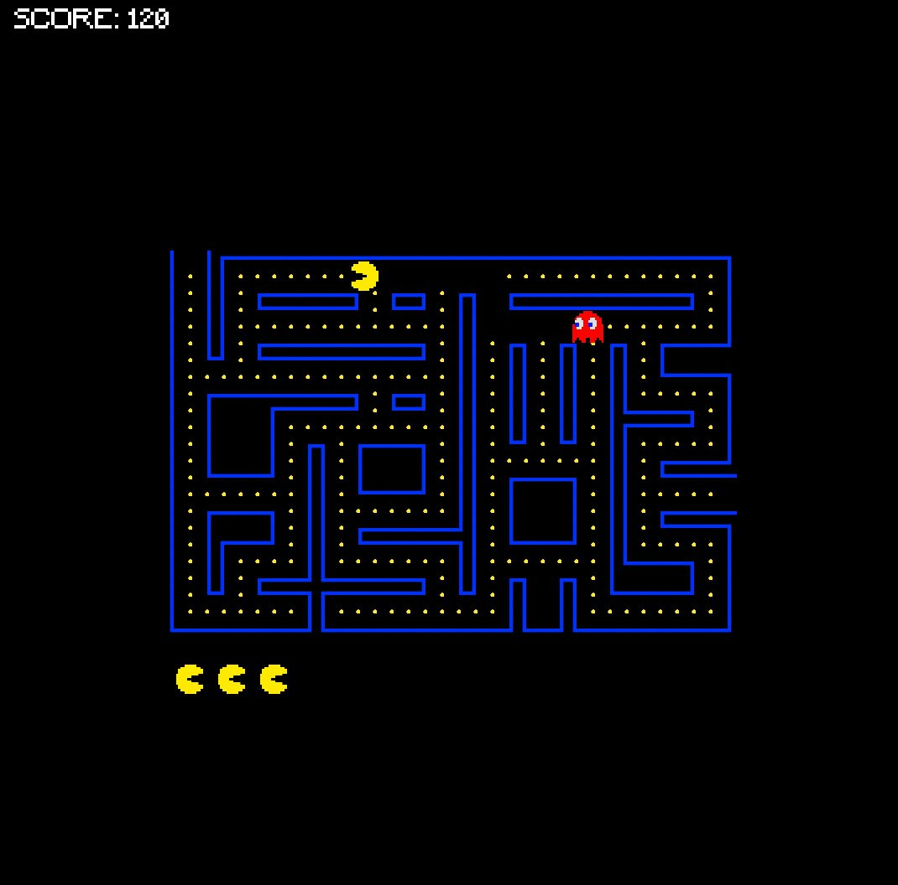
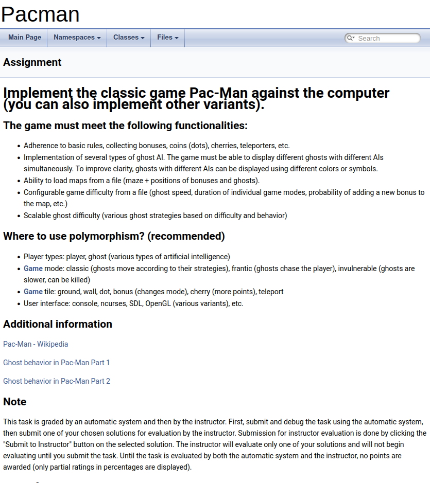
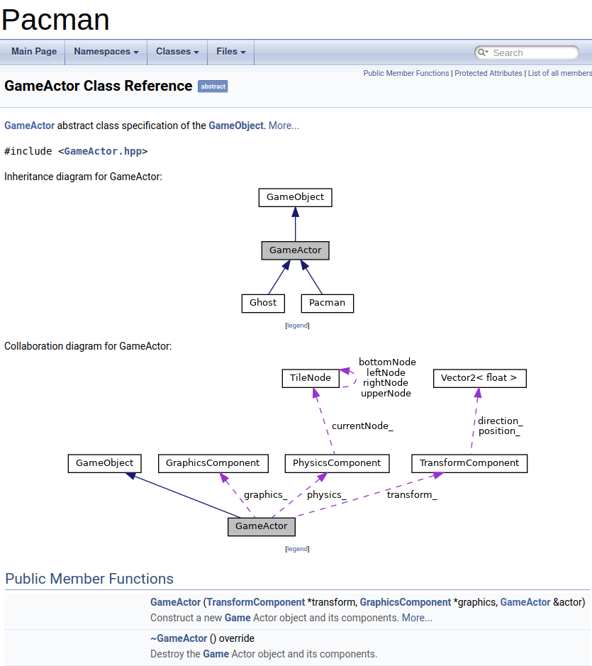
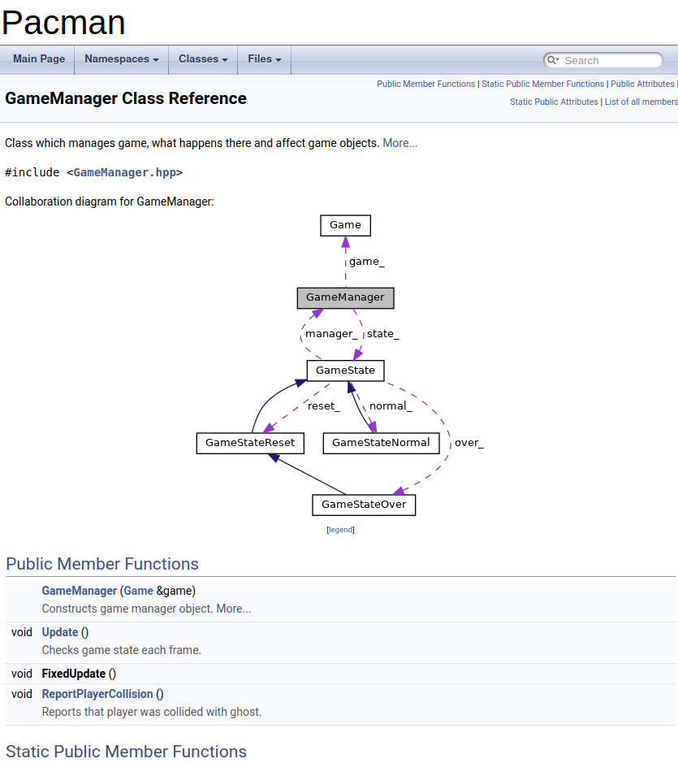

# Assignment

## Implement the classic game Pac-Man against the computer (you can also implement other variants).

### The game must meet the following functionalities:

* Adherence to basic rules, collecting bonuses, coins (dots), cherries, teleporters, etc.
* Implementation of several types of ghost AI. The game must be able to display different ghosts with different AIs simultaneously. To improve clarity, ghosts with different AIs can be displayed using different colors or symbols.
* Ability to load maps from a file (maze + positions of bonuses and ghosts).
* Configurable game difficulty from a file (ghost speed, duration of individual game modes, probability of adding a new bonus to the map, etc.)
* Scalable ghost difficulty (various ghost strategies based on difficulty and behavior)

### Where to use polymorphism? (recommended)

* Player types: player, ghost (various types of artificial intelligence)
* Game mode: classic (ghosts move according to their strategies), frantic (ghosts chase the player), invulnerable (ghosts are slower, can be killed)
* Game tile: ground, wall, dot, bonus (changes mode), cherry (more points), teleport
* User interface: console, ncurses, SDL, OpenGL (various variants), etc.

### Additional information

[Pac-Man - Wikipedia](https://en.wikipedia.org/wiki/Pac-Man)

[Ghost behavior in Pac-Man Part 1](http://programujte.com/clanek/2011010500-chovani-duchu-ve-hre-pac-man-cast-1/)

[Ghost behavior in Pac-Man Part 2](http://programujte.com/clanek/2011010900-chovani-duchu-ve-hre-pac-man-cast-2/)

### Note

This task is graded by an automatic system and then by the instructor. First, submit and debug the task using the automatic system, then submit one of your chosen solutions for evaluation by the instructor. Submission for instructor evaluation is done by clicking the "Submit to Instructor" button on the selected solution. The instructor will evaluate only one of your solutions and will not begin evaluating until you submit the task. Until the task is evaluated by both the automatic system and the instructor, no points are awarded (only partial ratings in percentages are displayed).

# Results

Application is created using SDL graphic library.



Also look at video how it works (video in some moments is lagging, but it is recording lag, not of the game):
[pacman_showcase.webm](docs%2Fpacman_showcase.webm)

### Installing Dependencies

For running the game:
```shell
sudo apt install libsdl2-dev libsdl2-image-dev libsdl2-ttf-dev
```
For building documentation:
```shell
sudo apt install doxygen
```

### How to run:

```shell
# build
make all
# run
make run
```

### How to play:

- Hold arrows to change direction of the pacman.
- User portals to slow down the ghost and to teleport.
- Pick up all the scores to win.
- Game is over when you lose all the lives.

### Documentation:

To generate documentation run:

```shell
make doc
```

Then open doc/html/index.html to read generated documentation.


Short showcase of documentation:






### Source Code Structure:

```text
src
├── components
│   ├── AICommands.cpp
│   ├── AICommands.hpp
│   ├── AI_components
│   │   ├── AIComponent.cpp
│   │   ├── AIComponent.hpp
│   │   ├── Blinky.cpp
│   │   ├── Blinky.hpp
│   │   ├── Clyde.cpp
│   │   ├── Clyde.hpp
│   │   ├── Inky.cpp
│   │   ├── Inky.hpp
│   │   ├── Pinky.cpp
│   │   └── Pinky.hpp
│   ├── AnimationComponent.cpp
│   ├── AnimationComponent.hpp
│   ├── Command.cpp
│   ├── Command.hpp
│   ├── ControllerComponent.cpp
│   ├── ControllerComponent.hpp
│   ├── GraphicsComponent.cpp
│   ├── GraphicsComponent.hpp
│   ├── PhysicsComponent.cpp
│   ├── PhysicsComponent.hpp
│   ├── PlayerController.cpp
│   ├── PlayerController.hpp
│   ├── TransformComponent.cpp
│   └── TransformComponent.hpp
├── game_engine
│   ├── GameAudio.cpp
│   ├── GameAudio.hpp
│   ├── Game.cpp
│   ├── GameEvents.cpp
│   ├── GameEvents.hpp
│   ├── GameFilesystem.cpp
│   ├── GameFilesystem.hpp
│   ├── GameGraphics.cpp
│   ├── GameGraphics.hpp
│   ├── Game.hpp
│   ├── GameLocator.cpp
│   ├── GameLocator.hpp
│   ├── GameManager.cpp
│   ├── GameManager.hpp
│   ├── GameMap.cpp
│   ├── GameMap.hpp
│   ├── GameTime.cpp
│   └── GameTime.hpp
├── game_objects
│   ├── Bonus.cpp
│   ├── Bonus.hpp
│   ├── Controller.cpp
│   ├── Controller.hpp
│   ├── CrossTile.cpp
│   ├── CrossTile.hpp
│   ├── EmptyTile.cpp
│   ├── EmptyTile.hpp
│   ├── GameActor.cpp
│   ├── GameActor.hpp
│   ├── GameObject.cpp
│   ├── GameObject.hpp
│   ├── Ghost.cpp
│   ├── Ghost.hpp
│   ├── NullTile.cpp
│   ├── NullTile.hpp
│   ├── Pacman.cpp
│   ├── Pacman.hpp
│   ├── PortalTile.cpp
│   ├── PortalTile.hpp
│   ├── Tile.cpp
│   ├── Tile.hpp
│   ├── TunnelTile.cpp
│   ├── TunnelTile.hpp
│   ├── WallTile.cpp
│   └── WallTile.hpp
├── game_states
│   ├── GameState.cpp
│   ├── GameState.hpp
│   ├── GameStateNormal.cpp
│   ├── GameStateNormal.hpp
│   ├── GameStateOver.cpp
│   ├── GameStateOver.hpp
│   ├── GameStateReset.cpp
│   └── GameStateReset.hpp
├── main.cpp
├── structures
│   ├── MapParser.cpp
│   ├── MapParser.hpp
│   ├── MapReader.cpp
│   ├── MapReader.hpp
│   ├── NullTexture.cpp
│   ├── NullTexture.hpp
│   ├── Text.cpp
│   ├── Text.hpp
│   ├── Texture.cpp
│   ├── Texture.hpp
│   ├── TextureSize.hpp
│   ├── TextureSize.inl
│   ├── TileNodeBuilder.cpp
│   ├── TileNodeBuilder.hpp
│   ├── TileNode.cpp
│   ├── TileNode.hpp
│   ├── Vector2.hpp
│   └── Vector2.inl
└── UI
    ├── Canvas.cpp
    ├── Canvas.hpp
    ├── UIElement.cpp
    └── UIElement.hpp

7 directories, 101 files
```