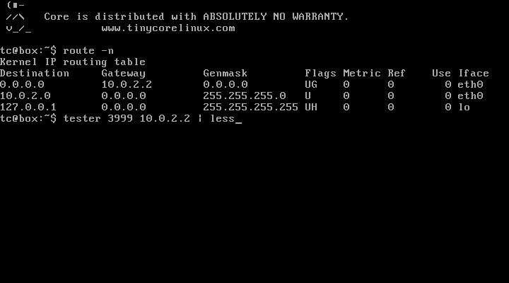

# Annotation
The goal of this task is to create a multithreaded server for TCP/IP communication and implement a communication protocol according to a given specification. Note, the implementation of the client part is not included in this task! The client part is realized by the testing environment.

# Assignment
Create a server for automatic control of remote robots. The robots log in to the server themselves, and the server guides them to the center of the coordinate system. For testing purposes, each robot starts at random coordinates and tries to reach the coordinate [0,0]. At the target coordinate, the robot must pick up a secret. Along the way, the robots may encounter obstacles that they must avoid. The server is capable of navigating multiple robots simultaneously and flawlessly implements the communication protocol.

# Detailed Specification

Communication between the server and the robots is realized through a fully text-based protocol. Each command ends with a pair of special symbols “\a\b” (these are the two characters '\a' and '\b'). The server must adhere to the communication protocol precisely but must also account for imperfect robot firmware (see the Special Situations section).

### Server Messages:

| Name                            | Message                              | Description                                        |
|---------------------------------|--------------------------------------|----------------------------------------------------|
| SERVER_CONFIRMATION             | <16-bit number in decimal notation>\a\b | Message with a confirmation code. Can contain up to 5 digits and ending sequence \a\b. |
| SERVER_MOVE                     | 102 MOVE\a\b                         | Command to move one field forward                  |
| SERVER_TURN_LEFT                | 103 TURN LEFT\a\b                    | Command to turn left                               |
| SERVER_TURN_RIGHT               | 104 TURN RIGHT\a\b                   | Command to turn right                              |
| SERVER_PICK_UP                  | 105 GET MESSAGE\a\b                  | Command to pick up a message                       |
| SERVER_LOGOUT                   | 106 LOGOUT\a\b                       | Command to terminate connection after successfully picking up a message |
| SERVER_KEY_REQUEST              | 107 KEY REQUEST\a\b                  | Server request for Key ID for communication        |
| SERVER_OK                       | 200 OK\a\b                           | Positive confirmation                              |
| SERVER_LOGIN_FAILED             | 300 LOGIN FAILED\a\b                 | Failed authentication                              |
| SERVER_SYNTAX_ERROR             | 301 SYNTAX ERROR\a\b                 | Syntax error in the message                        |
| SERVER_LOGIC_ERROR              | 302 LOGIC ERROR\a\b                  | Message sent in the wrong situation                |
| SERVER_KEY_OUT_OF_RANGE_ERROR   | 303 KEY OUT OF RANGE\a\b             | Key ID is not within the expected range            |


### Client Messages:

| Name                   | Message                   | Description                                                                                                                                                         | Example              | Maximum Length |
|------------------------|---------------------------|---------------------------------------------------------------------------------------------------------------------------------------------------------------------|----------------------|----------------|
| CLIENT_USERNAME        | <user name>\a\b           | Message with username. The name can be any sequence of characters except for the pair \a\b and will never match the message CLIENT_RECHARGING.                      | Umpa_Lumpa\a\b       | 20             |
| CLIENT_KEY_ID          | <Key ID>\a\b              | Message containing Key ID. It can only contain an integer number with a maximum of three digits.                                                                    | 2\a\b                | 5              |
| CLIENT_CONFIRMATION    | <16-bit number in decimal notation>\a\b | Message with a confirmation code. Can contain up to 5 digits and ending sequence \a\b.                                                                              | 1009\a\b             | 7              |
| CLIENT_OK              | OK <x> <y>\a\b            | Confirmation of the movement command, where x and y are the integer coordinates of the robot after executing the movement command.                                  | OK -3 -1\a\b         | 12             |
| CLIENT_RECHARGING      | RECHARGING\a\b            | The robot started recharging and stopped responding to messages.                                                                                                   |                      | 12             |
| CLIENT_FULL_POWER      | FULL POWER\a\b            | The robot replenished its energy and is accepting commands again.                                                                                                  |                      | 12             |
| CLIENT_MESSAGE         | <text>\a\b                | Text of the picked-up secret message. It can contain any characters except for the ending sequence \a\b and will never match the message CLIENT_RECHARGING.         | Haf!\a\b             | 100            |


### Time Constants:

| Name                 | Value [s] | Description                                                                      |
|----------------------|-----------|----------------------------------------------------------------------------------|
| TIMEOUT              | 1         | The server and client expect a response from the other party within this interval. |
| TIMEOUT_RECHARGING   | 5         | Time interval during which the robot must complete recharging.                   |


## Authentication

Both the server and the client know five pairs of authentication keys (these are not public and private keys):

| Key ID | Server Key | Client Key |
|--------|------------|------------|
| 0      | 23019      | 32037      |
| 1      | 32037      | 29295      |
| 2      | 18789      | 13603      |
| 3      | 16443      | 29533      |
| 4      | 18189      | 21952      |


### Communication Protocol with Robots

Each robot begins communication by sending its username (message CLIENT_USERNAME). The username can be any sequence of 18 characters not containing the sequence "\a\b". In the next step, the server requests the client to send the Key ID (message SERVER_KEY_REQUEST), which is the identifier of the key pair to be used for authentication. The client responds with the message CLIENT_KEY_ID, sending the Key ID. After this, the server knows the correct key pair and can compute the "hash" code from the username using the following formula:

**Username:** Mnau!

**ASCII Representation:** 77 110 97 117 33

**Resulting Hash:** 

`((77 + 110 + 97 + 117 + 33) * 1000) % 65536 = 40784`

The resulting hash is a 16-bit number in decimal form. The server then adds the server key to the hash, with overflow managed by wrapping around (example for Key ID 0):

`(40784 + 23019) % 65536 = 63803`

The resulting server confirmation code is sent to the client as text in the SERVER_CONFIRM message. The client calculates the hash back from the received code and compares it to the expected hash computed from the username. If they match, the client creates a client confirmation code. The calculation of the client confirmation code is similar to the server's, but using the client key (example for Key ID 0):

`(40784 + 32037) % 65536 = 7285`

The client confirmation code is sent to the server in the CLIENT_CONFIRMATION message, which calculates the hash back from it and compares it to the original username hash. If the values match, it sends the SERVER_OK message, otherwise, it responds with SERVER_LOGIN_FAILED and terminates the connection. The sequence is shown in the following diagram:

```text
Client                  Server
​------------------------------------------
CLIENT_USERNAME     --->
                    <---    SERVER_KEY_REQUEST
CLIENT_KEY_ID       --->
                    <---    SERVER_CONFIRMATION
CLIENT_CONFIRMATION --->
                    <---    SERVER_OK
                              or
                            SERVER_LOGIN_FAILED
                      .
                      .
                      .
```


The server does not know the usernames in advance. Therefore, robots can choose any name, but they must know the client and server key pairs. Key pairs ensure mutual authentication and prevent the authentication process from being compromised by simple eavesdropping.

### Moving the Robot to the Target

The robot can move only straight (SERVER_MOVE) and can turn on the spot to the right (SERVER_TURN_RIGHT) or to the left (SERVER_TURN_LEFT). After each move command, it sends a confirmation (CLIENT_OK) that includes the current coordinates. The server does not know the robot's initial position. It must determine the robot's location (position and direction) solely from its responses. To prevent the robot from wandering endlessly, each robot has a limited number of moves (only forward moves). The number of moves should be sufficient for a reasonable transfer of the robot to the target. Here is an example communication. The server first moves the robot forward twice to detect its current state, then directs it towards the target coordinates [0,0].

```text
Client                  Server
​------------------------------------------
                  .
                  .
                  .
                <---    SERVER_MOVE
                          or
                        SERVER_TURN_LEFT
                          or
                        SERVER_TURN_RIGHT
CLIENT_OK       --->
                <---    SERVER_MOVE
                          or
                        SERVER_TURN_LEFT
                          or
                        SERVER_TURN_RIGHT
CLIENT_OK       --->
                <---    SERVER_MOVE
                          or
                        SERVER_TURN_LEFT
                          or
                        SERVER_TURN_RIGHT
                  .
                  .
                  .
```


Immediately after authentication, the robot expects at least one movement command - SERVER_MOVE, SERVER_TURN_LEFT, or SERVER_TURN_RIGHT! It cannot immediately try to pick up the secret message. On the way to the target, there are many obstacles that the robots must circumvent. The following rules apply to obstacles:

- An obstacle always occupies a single coordinate.
- It is guaranteed that each obstacle has all eight surrounding coordinates free (so it can always be easily bypassed).
- It is guaranteed that an obstacle never occupies coordinate [0,0].
- If a robot collides with an obstacle more than twenty times, it is damaged and terminates the connection.
- An obstacle is detected when the robot receives a move forward command (SERVER_MOVE) but its coordinates do not change (the CLIENT_OK message contains the same coordinates as in the previous step). If the move does not occur, the robot's remaining moves count does not decrease.

### Picking Up the Secret Message

After the robot reaches the target coordinate [0,0], it attempts to pick up the secret message (SERVER_PICK_UP message). If the robot is asked to pick up the message but is not at the target coordinate, it triggers self-destruction and communication with the server is interrupted. When attempting to pick up the message at the target coordinate, the robot responds with a CLIENT_MESSAGE. The server must respond to this message with a SERVER_LOGOUT. (It is guaranteed that the secret message never matches the CLIENT_RECHARGING message, and if this message is received after a pick-up request, it always indicates recharging.) After this, both the client and the server terminate the connection. Example communication for picking up the message:

```text
Client                  Server
​------------------------------------------
                  .
                  .
                  .
                <---    SERVER_PICK_UP
CLIENT_MESSAGE  --->
                <---    SERVER_LOGOUT
```


### Recharging

Each robot has a limited energy source. When its battery starts to run low, it notifies the server and begins recharging from a solar panel. During recharging, it does not respond to any messages. Once finished, it informs the server and continues where it left off before recharging. If the robot does not finish recharging within the TIMEOUT_RECHARGING interval, the server terminates the connection.

```text
Client                    Server
​------------------------------------------
CLIENT_USERNAME   --->
                  <---    SERVER_CONFIRMATION
CLIENT_RECHARGING --->

      ...

CLIENT_FULL_POWER --->
CLIENT_OK         --->
                  <---    SERVER_OK
                            or
                          SERVER_LOGIN_FAILED
                    .
                    .
                    .
```

Another example:

```text
Client                  Server
​------------------------------------------
                    .
                    .
                    .
                  <---    SERVER_MOVE
CLIENT_OK         --->
CLIENT_RECHARGING --->

      ...

CLIENT_FULL_POWER --->
                  <---    SERVER_MOVE
CLIENT_OK         --->
                  .
                  .
                  .
```


### Error Situations

Some robots may have damaged firmware and communicate incorrectly. The server should detect this inappropriate behavior and respond correctly.

#### Authentication Errors

If the Key ID in the CLIENT_KEY_ID message is outside the expected range (i.e., not between 0-4), the server responds with the SERVER_KEY_OUT_OF_RANGE_ERROR message and terminates the connection. For simplicity, negative values are also considered numbers. If the Key ID in the CLIENT_KEY_ID message is not a number (e.g., letters), the server responds with a SERVER_SYNTAX_ERROR.

If the numerical value in the CLIENT_CONFIRMATION message (even a negative number) does not match the expected confirmation, the server sends a SERVER_LOGIN_FAILED message and terminates the connection. If the value is not purely numerical, the server sends a SERVER_SYNTAX_ERROR message and terminates the connection.

#### Syntax Error

The server always responds to a syntax error immediately upon receiving the message containing the error. The server sends the robot a SERVER_SYNTAX_ERROR message and must terminate the connection as soon as possible. Syntactically incorrect messages include:

- An incoming message longer than the defined number of characters for each message (including terminating characters \a\b). Message lengths are defined in the client message table.
- An incoming message that does not syntactically match any of the CLIENT_USERNAME, CLIENT_KEY_ID, CLIENT_CONFIRMATION, CLIENT_OK, CLIENT_RECHARGING, or CLIENT_FULL_POWER messages.
- Each incoming message is tested for maximum size, and only the CLIENT_CONFIRMATION, CLIENT_OK, CLIENT_RECHARGING, and CLIENT_FULL_POWER messages are tested for their content (CLIENT_USERNAME and CLIENT_MESSAGE messages can contain anything).

#### Logical Error

A logical error occurs only during recharging - when the robot sends the CLIENT_RECHARGING message and then sends any message other than CLIENT_FULL_POWER, or if it sends the CLIENT_FULL_POWER message without previously sending CLIENT_RECHARGING. The server responds to such situations by sending the SERVER_LOGIC_ERROR message and immediately terminating the connection.

#### Timeout

The protocol for communicating with robots includes two types of timeouts:

- **TIMEOUT** - communication timeout. If the robot or server does not receive any communication (not necessarily a complete message) from its counterpart within this interval, they consider the connection lost and immediately terminate it.
- **TIMEOUT_RECHARGING** - recharging timeout. After the server receives the CLIENT_RECHARGING message, the robot must send the CLIENT_FULL_POWER message within this interval. If the robot does not do so, the server must immediately terminate the connection.

### Special Situations
When communicating over more complex network infrastructure, two situations may occur:

1. A message may arrive divided into several parts, which are read sequentially from the socket. (This happens due to segmentation and possible delays of some segments during network travel.)
2. Messages sent shortly one after another may arrive almost simultaneously. Both can be read at once from the socket. (This happens when the server does not have time to read the first message from the buffer before the second message arrives.)

Using a direct connection between the server and robots combined with powerful hardware cannot naturally lead to these situations, so testers create them artificially. In some tests, both situations are combined.

Every properly implemented server should handle these situations. Robot firmwares consider and even exploit this fact. If a protocol situation involves messages from the robot having a predetermined order, they are sent together in this order. This allows the probes to reduce their power consumption and simplifies protocol implementation (from their perspective).

### Server Optimization
The server optimizes the protocol by not waiting for the completion of an obviously incorrect message. For example, in response to an authentication request, the robot sends only part of the username message. The server receives, for instance, 22 characters of the username but still has not received the terminating sequence \a\b. Since the maximum message length is 20 characters, it is clear that the incoming message cannot be valid. The server then responds by not waiting for the rest of the message, sending a SERVER_SYNTAX_ERROR, and terminating the connection. The same principle should be applied when picking up the secret message.

In the part of the communication where the robot navigates to the target coordinates, three possible messages are expected: CLIENT_OK, CLIENT_RECHARGING, or CLIENT_FULL_POWER. If the server reads part of an incomplete message and this part is longer than the maximum length of these messages, it sends a SERVER_SYNTAX_ERROR and terminates the connection. To assist with optimization, each message's maximum size is listed in the table.

### Communication Example

```text
C: "Oompa Loompa\a\b"
S: "107 KEY REQUEST\a\b"
C: "0\a\b"
S: "64907\a\b"
C: "8389\a\b"
S: "200 OK\a\b"
S: "102 MOVE\a\b"
C: "OK 0 0\a\b"
S: "102 MOVE\a\b"
C: "OK -1 0\a\b"
S: "104 TURN RIGHT\a\b"
C: "OK -1 0\a\b"
S: "104 TURN RIGHT\a\b"
C: "OK -1 0\a\b"
S: "102 MOVE\a\b"
C: "OK 0 0\a\b"
S: "105 GET MESSAGE\a\b"
C: "Tajny vzkaz.\a\b"
S: "106 LOGOUT\a\b"
```


### Testing
A Tiny Core Linux operating system image is prepared for testing, containing a home assignment tester. The image is compatible with VirtualBox.

#### Tester
Download and extract the image. Run the resulting file in VirtualBox. After booting, a shell is immediately available. The tester is started with the command `tester`:

`tester <port number> <remote address> [test numbers]`


The first parameter is the port number on which your server will listen. The next parameter is the remote server address. If your server is running on the same computer as VirtualBox, use the default gateway address. The procedure is illustrated in the following image:



The output is quite long, so it is advantageous to redirect it to the `less` command, where you can navigate easily. You can also use the "Shift+PageUp" or "Shift+PageDown" key combinations to move up or down in the output (however, the history is short, so you cannot move far back).

If no test number is specified, all tests will run sequentially. Tests can also be run individually. The following example runs tests 2, 3, and 8:

`tester 3999 10.0.2.2 2 3 8 | less`

