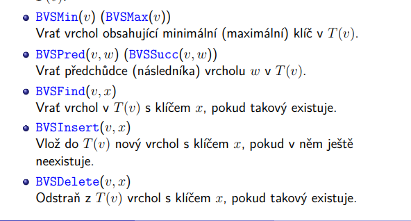
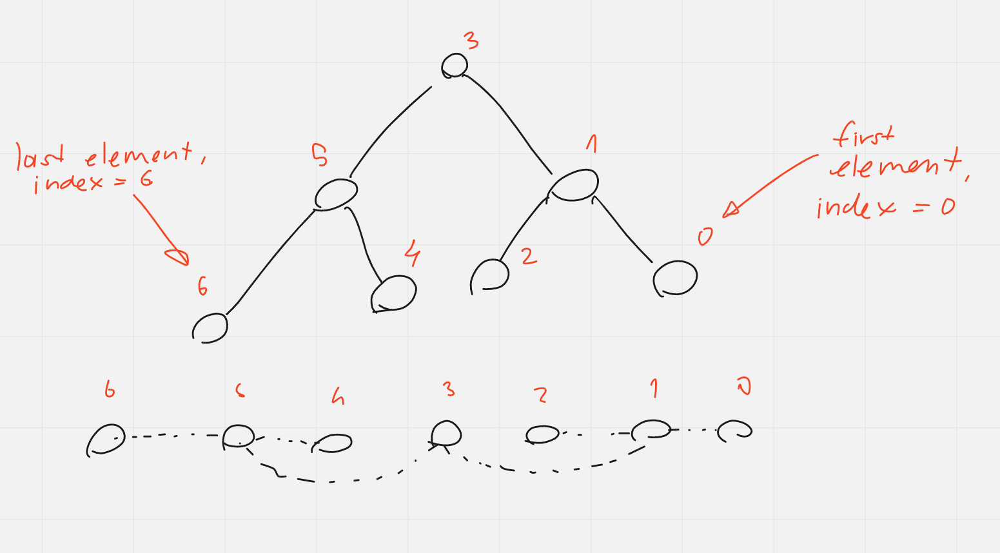
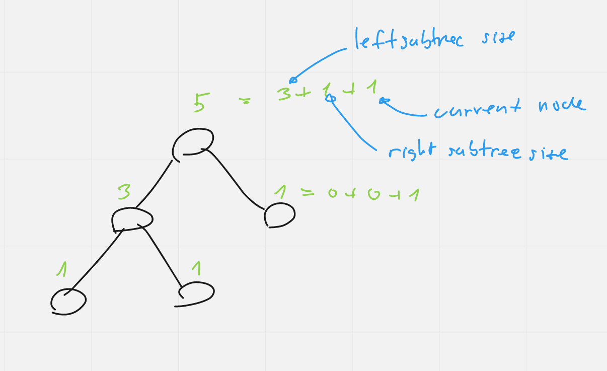
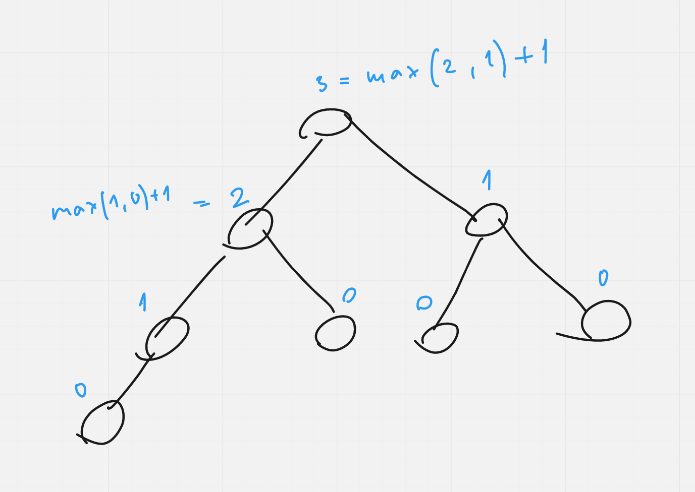
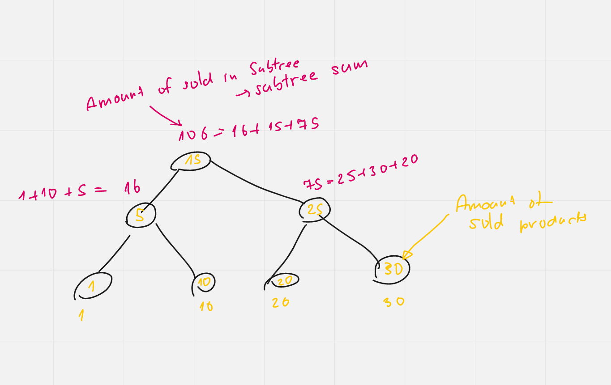
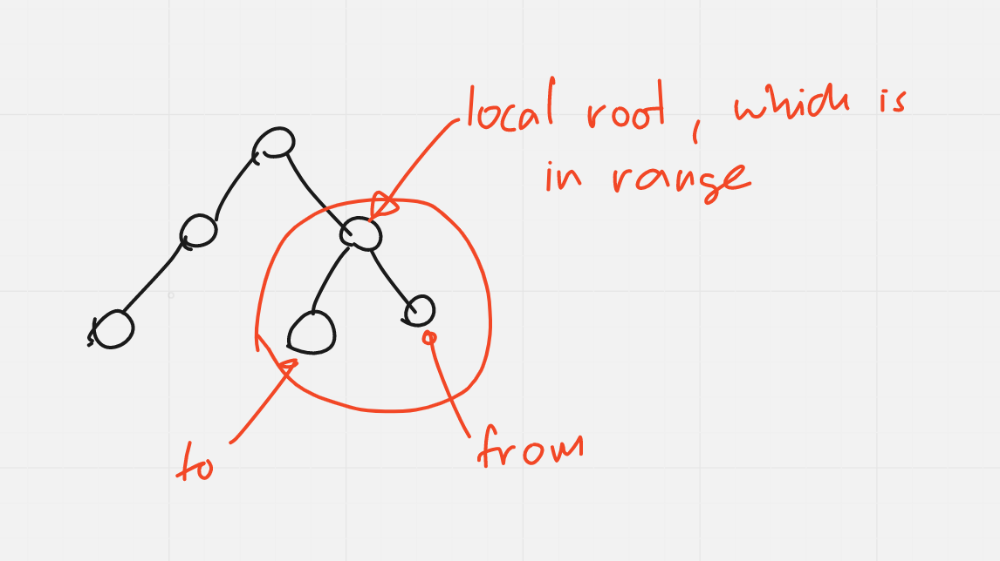
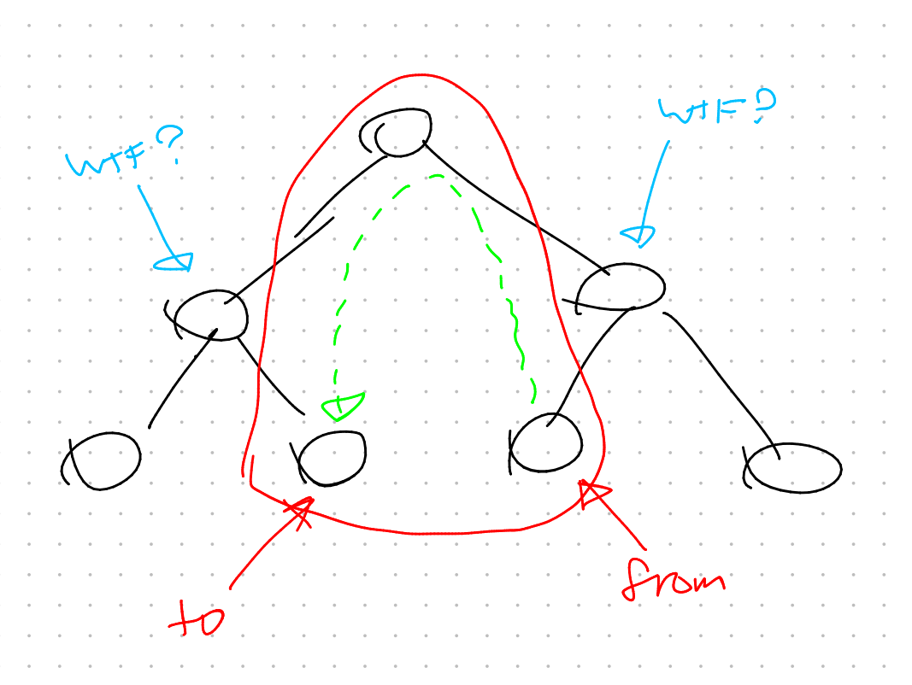
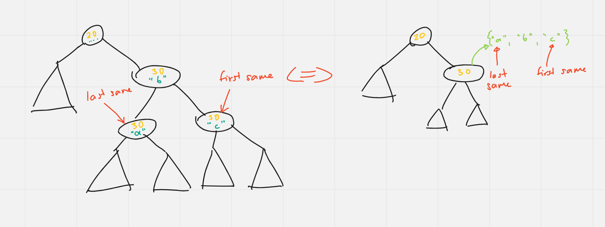
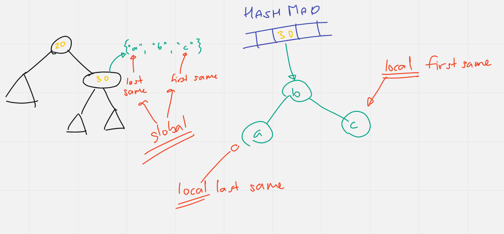
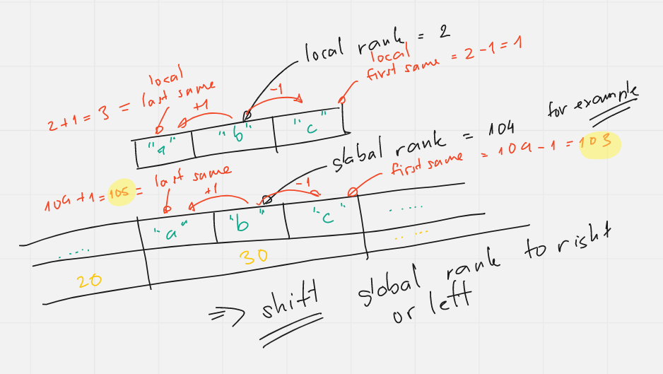

# AG1 Second Progtest - Guide

Insert all guide files into your project and view them through your IDE, which should support markdown and format the text. For correct display, the guide should be in the same folder where the `img` folder is located.

***

## Foreword

The second progtest has a simple algorithm but a complex implementation - I recommend writing at least a couple of tests for each function along the way, ideally covering as many edge cases as possible. If you do this methodically from the start, you will save yourself a lot of nerves later.

The goal of this progtest - what and how to implement - greatly depends on how many points you want to achieve, so below I provide the corresponding scale.

In this guide, I will try to highlight potential blind alleys and present the main ideas for implementation to save you a lot of time. What I propose is not the only correct way to do this progtest.

This time there will be no pseudocode - the main thing is that you understand the idea. I will not help with specific implementation, as it takes a lot of time, and you are capable of doing it yourself.

## Requirements for Different Scores

***

### 1 Point

If you are very short on time and want to get at least something - use a hash map, where each product is mapped to the number of sold items. Update this table as sales occur. In all operations, then take and extract each `pair<Product, Amount>` into a vector and sort it. Then, search for the information you need from the sorted vector.

*** 

### 3.5 Points

For 2 points, it's enough to have a basic BVS tree, not even AVL, but indexing is necessary. The complexities are as follows:

`size_t products() const` - O(1)

`void sell(const Product& p, size_t amount)` - O(log(n))

`size_t rank(const Product& p) const` - O(log(n))

`const Product& product(size_t rank) const` - O(log(n))

`size_t sold(size_t r) const` - O(log(n))

`size_t sold(size_t from, size_t to) const` - O(n)

### BVS Tree

Implement a basic binary tree, for now, unbalanced. The key will be `pair<Amount, Product>`, i.e., first compare by quantity, then just for key uniqueness and products.

Create a new class for the tree as a template. Also, create an auxiliary class `Node` as a template with the same template types.

***

**Important!**
Choose template types so that inside the tree and node classes you can use `Amount` and have access to it separately! If you do `template<typename Key>` and your `Key` type is `pair<Amount, Product>` and you build your structure on that, then later, when aiming for 10 points, you won't be able to extract the first attribute `Amount` from `Key`. Nothing like `Key key; key.first ...` is allowed.

***

For the tree, I recommend using raw pointers - smart pointers can break templates and the code won't compile. It will cause fewer headaches.

Start implementing all BVS methods - the algorithms are already written in the previous tasks:



I strongly recommend understanding the **principle** of how these methods work - absorb it like mother's milk. It's crucial because this principle can be used in all other methods that need to be added.

The main feature is that **we always update all information** about our tree **only when returning** to the main node, from where the recursion ended. If we change one node, we need to update all ***super-trees***, while the sub-trees remain in order and don't need updating. Once again - **update all info in the nodes when returning to the root!!**

If you don't know where to start - in PA2 there is a seminar on templates, and there is code with a binary tree implementation - a good example of where to start, though the algorithms there are entirely different - non-recursive.

***

To implement `BVSSucc` and `BVSPred`, you need to know the parent of each node.

***
**A very important rule:**

**Store all information about your tree as attributes in the nodes, i.e., as attributes in the `Node` class.**
This rule applies to any information. Keep everything in the nodes.
***

For now, in our case, store a pointer to the parent in each node to correctly implement `BVSSucc` and `BVSPred` exactly as in the previous task. That means in `Insert` you must set up the parent pointer correctly, and in `Delete` you must change it correctly when deleting or moving. The root's parent pointer will be `nullptr`. When deleting, make sure the tree's root pointer indeed points to the root.

### Indexing

Besides the operations mentioned above, you need to add two more methods that find the node's index in O(log(n)).

An index in the tree is the position of your node among all others - just like in a vector:



You can find the index linearly - using `BVSMin` or `BVSMax` to find the extreme indices and iterate through our tree by indices using `BVSSucc` or `BVSPred`. The problem is that this will always be amortized O(n). We need O(log(n)).

To achieve this, each time we insert or delete, we update the information about the number of nodes in the subtree rooted at our current node and update all nodes up to the root (don't forget to update your global root).



After this, we can quickly find the index logarithmically in this way:

```text
Find index i in the tree:
    if index i < size of right subtree
        Find i in the right subtree and return it
    else if index i > (size of this subtree - size of left subtree - 1)
        Find (i - size of right subtree - 1) in the left subtree and return it
    else
        Return this node
```


A product's rank is essentially its index in the tree. You find the key by index, which contains information about the product and the sales amount.

You need to write a reverse function that, given a key, finds its index.

In the end, if you implement all this, you'll have a task worth 3.5 points.

***

### 7 Points

You need to implement an AVL tree.

The solution principle and rotation algorithm are exactly the same as in the previous tasks, so look it up and figure it out yourself.

The point is that now on the way back after `Insert` and `Delete`, you also update the information about your tree's depth. A leaf has a depth of 0 (or 1, if you want to start from 1). Start building the tree from there. Each time a node is added or removed, you should update each node on the way back - take the maximum between the right subtree depth and the left subtree depth, and add one, as the current node is above them.



***

**Important!**

If you implemented everything correctly, in the `Insert` and `Delete` operations, you should always update all node information in the same place, **after which** you check if the tree is balanced or not.

***

On the way up, you also check if your tree is unbalanced - refer to the previous tasks for how and what to check - use the depth of the right and left subtrees for verification.

***

**Important!**

When you perform a rotation - you change the structure of your tree! Update the information in the nodes! Update the parent pointers!

***

### 10 Points

For 10 points, the `size_t sold(size_t from, size_t to) const` function should be faster than O(n), i.e., O(log(n)).

Here everything is straightforward - in addition to the information about the number of nodes and depth, you also store information about the number of sold items in the subtree - in the same way as you updated the depth and number of nodes - you update the sales count on the way to the global root when the tree structure changes.



When you need to find the sales sum in the range from index 1 to 3, you should:

1) Find the only existing local root of the subtree that contains your range:



2) From the local root - move left to the minimum of your range, i.e., to `to`, collecting the sum of sold items on the way. **You should do this at logarithmic speed, i.e., at each node in the range, decide whether to add the sum from the left or right subtree, add yourself to the global sum, and continue down to the minimum.**

3) From the local root - move right to the maximum of your range, i.e., to `from`. The principle is similar.

***

**Important - consider this situation!**



In such a situation, when descending, the node **is not within your range**, do not add anything and just continue down to the minimum/maximum.

***

With the correct implementation, you will achieve 10 points.

### 12 Points

For 12 points, the bonus functions must be O(log(n)). To do this, you don't even need a multimap - it's enough to have a hash map that stores an AVL tree of products for each `Amount`.

I think the illustrations are enough to understand the idea:







***

That's all! Good luck with your progtest!

### Bonus

In the `tests` folder
