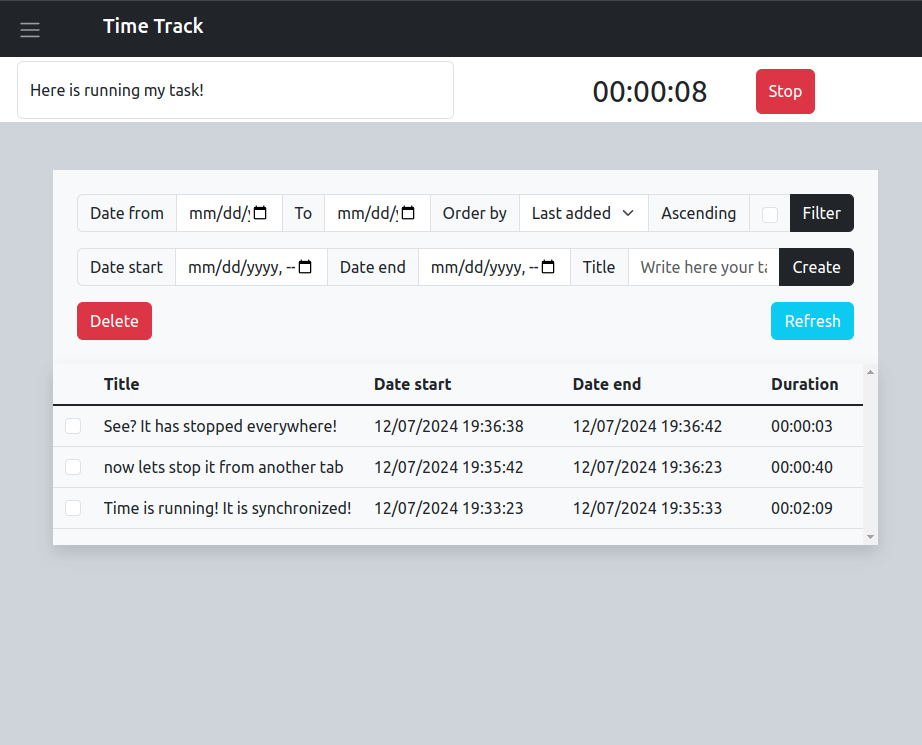
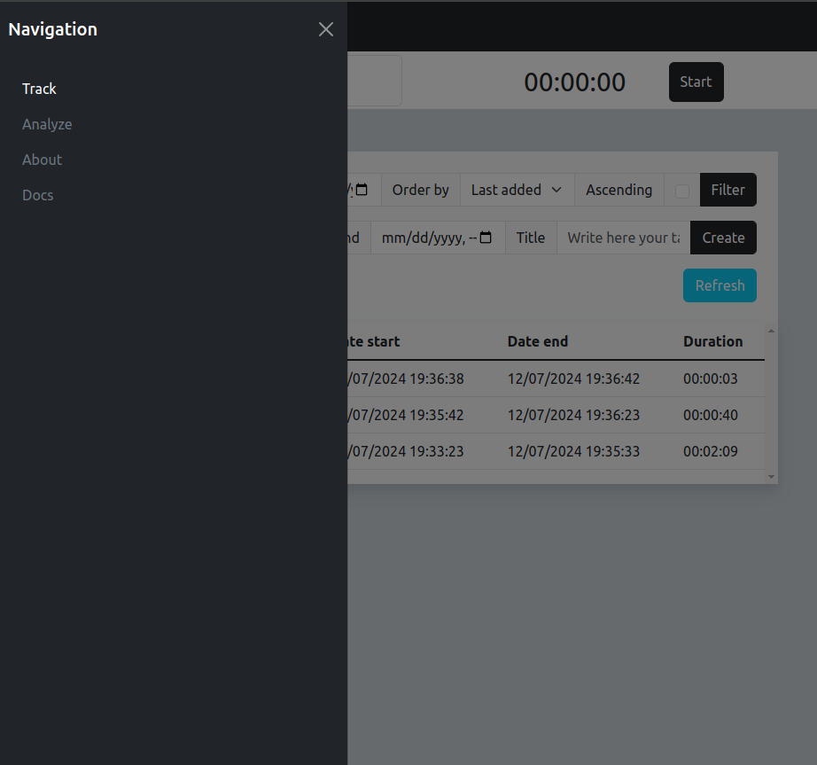
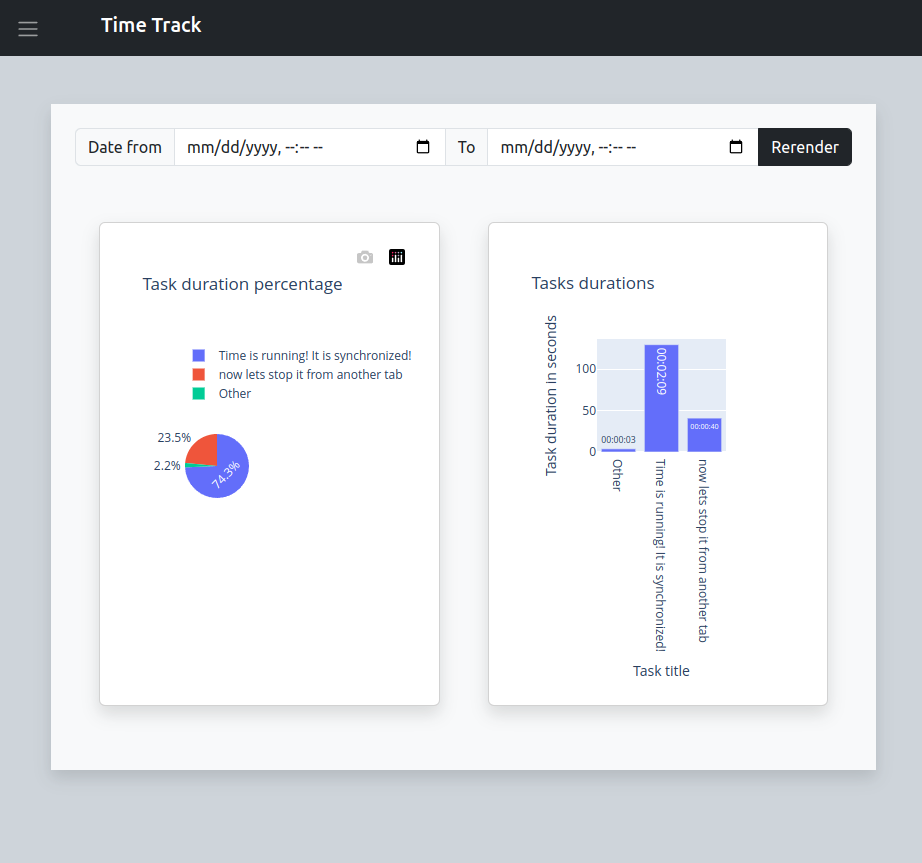
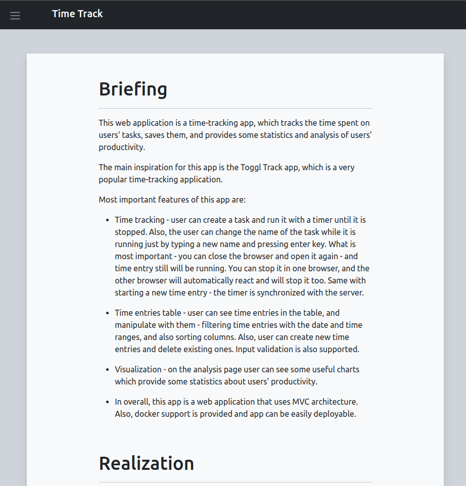
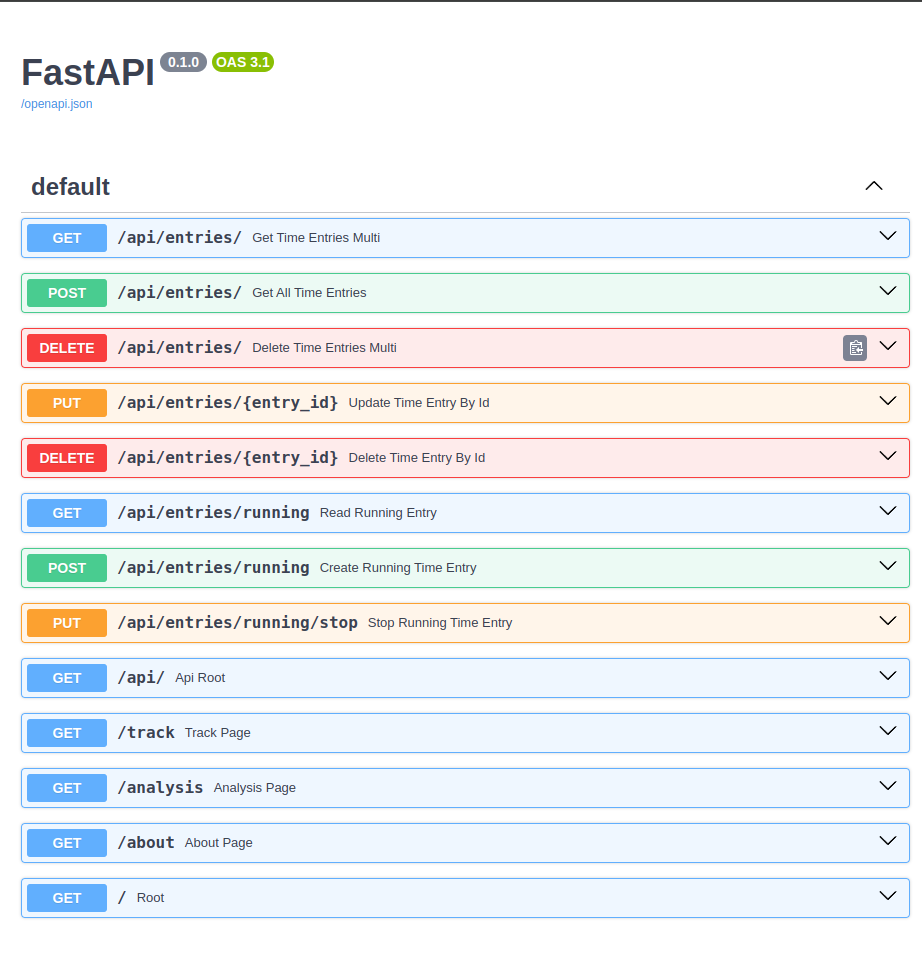
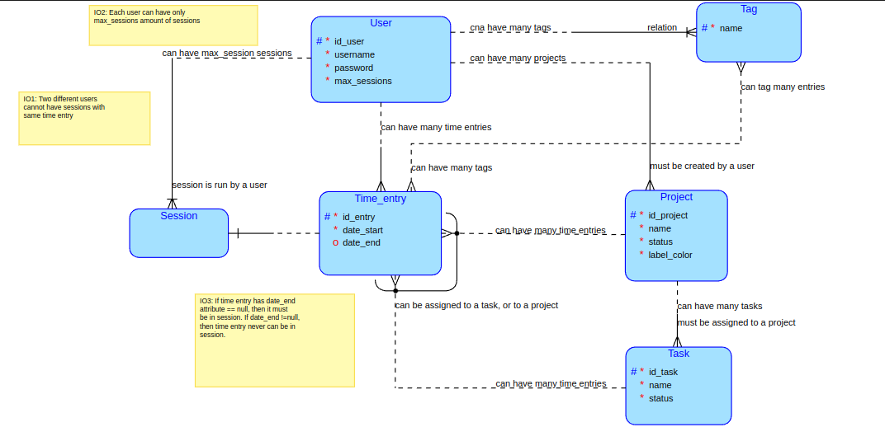
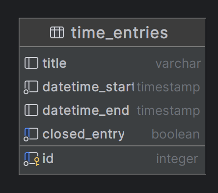

# Time Tracking Application

(ala Toggl Track)

Also watch [how_the_app_works.webm](doc%2Fhow_the_app_works.webm) video to see how it works.

***

## TL;DR 💨:

Run using **docker** 🏗:

> 1) run `$ docker compose up` 🏗
> 2) go fetch some coffee ☕ (not kidding, for the first time building images can take up to 10 minutes)
> 3) after docker compose finishes and runs up containers, go to http://localhost:8000/
> 4) go to **About** page using sidebar or directly open http://localhost:8000/about to see the report.
> 5) enjoy the app ✨ (if there are some problems - see **troubleshoots** 🔥🚒 section of this readme file)
> 6) run `$ docker compose exec app bash`
> 7) run `$ source /venv/bin/activate` to activate virtual environment
> 8) run `$ cd app/app/`
> 9) run `$ ./scripts/run_tests.sh` to run tests. Ignore both warnings about using deprecated features, they are
     irrelevant and are not mistakes.
> 10) run `$ ./scripts/pep8_pylint.sh` to run pylinter. It runs only on project sources without tests.

Run using **conda** 🐍:

> 1) in the project root run `$ ./scripts/conda_create_or_update_env.sh` to create bipyt-sp environment to run
     application
> 2) run `$ conda activate bipyt-sp` to activate new installed environment
> 3) run `$ docker compose up db` to run postgresql database
> 4) run `$ cd app/app/` and then `$ python -m main` to start application
> 5) go to http://localhost:8000/ and enjoy the app ✨
> 6) go to **About** page using sidebar or directly open http://localhost:8000/about to see the report.
> 7) run `$ cd ../` and then `$ ./scripts/run_tests.sh` to run tests. Ignore both warnings about using deprecated
     features, they are irrelevant and are not mistakes.
> 8) run `$ ./scripts/pep8_pylint.sh` to run pylinter. It runs only on project sources without tests.

## Troubleshoots 🔥🚒:

- Make sure you have internet connection. There are CDN links in the frontend html pages, which download all needed
  JavaScript and CSS files. Without them the app will not work.
- Make sure you run commands from appropriate directory. If you run scripts, run them in the directory where the
  **scripts/** directory lies, not inside the **scripts/** directory.
- If you have problems with **conda**, try to run `$ ./scripts/set_up_conda_channels.sh` in the project root to add
  conda-forge channel to conda. Then try to create conda environment again.
- If you have problems with **docker compose**, be sure you run newer `docker compose` tool instead of
  older `docker-compose`

***

# Brief description:

This is time tracking web application like [Toggl Track](https://toggl.com/), which allows you to track time spent on some tasks, manipulate with them, and get basic statistics on analyze page. 

## Frameworks:

Project mainly uses:
- [FastAPI](https://fastapi.tiangolo.com/) for controllers, 
- [SQLAlchemy](https://www.sqlalchemy.org/) for handling database and ORM, 
- [Pydantic](https://docs.pydantic.dev/) for schemas (aka dto) and configuration, 
- [Bootstrap](https://getbootstrap.com/) for CSS styles, 
- [HyperApp](https://github.com/jorgebucaran/hyperapp) - tiny javascript
framework for interactivity, 
- [Jinja2](https://jinja.palletsprojects.com/en/3.1.x/) template language.

Other used libraries:
- [Pandas](https://pandas.pydata.org/) (and a little bit [numpy](https://numpy.org/)) - for manipulation with time entries data
- [Plotly](https://plotly.com/) - for charts visualisation

## Views:

There are 4 working pages:
- [/track](http://localhost:8000/track) page - where you can start timer and manipulate with all time entries
- [/analysis](http://localhost:8000/analysis) page - where you have two plots about your time entries. BUT! If you have no time entries, plots will not render and page will be empty.
- [/about](http://localhost:8000/about) page - page with the report. There are more details about the project.
- [/docs](http://localhost:8000/docs) page - generated by FastAPI - provides you API of the server.

## API:

You can find server API on [/docs](http://localhost:8000/docs) page, from there you can also try some methods using generated OpenAPI interface.

## Database:

Application uses PostgreSQL database. Planned database scheme is as follows:

But this application is much more simple, and uses only one entity - Time Entries. The presented scheme above can be used for extension of the application.

Current database scheme:

## Report:

Report can be found on [/about](http://localhost:8000/about) page or in the **bardanik.pdf** file in the root directory.

Report contains more details about the project.
