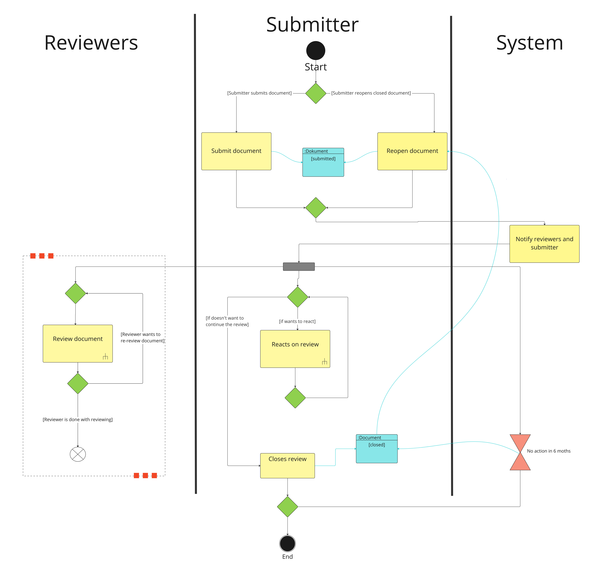
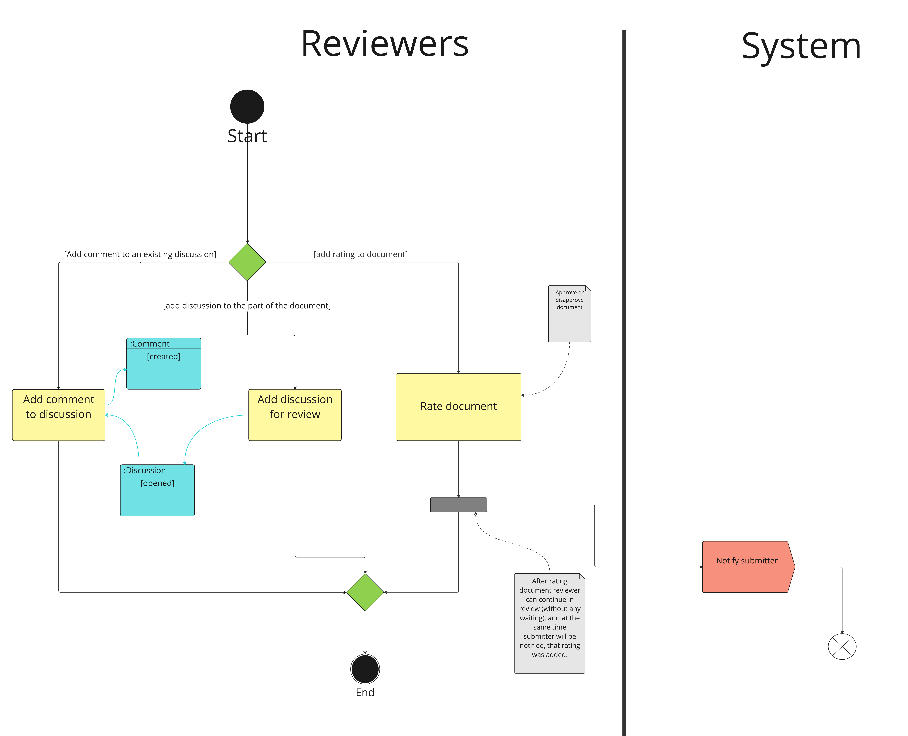
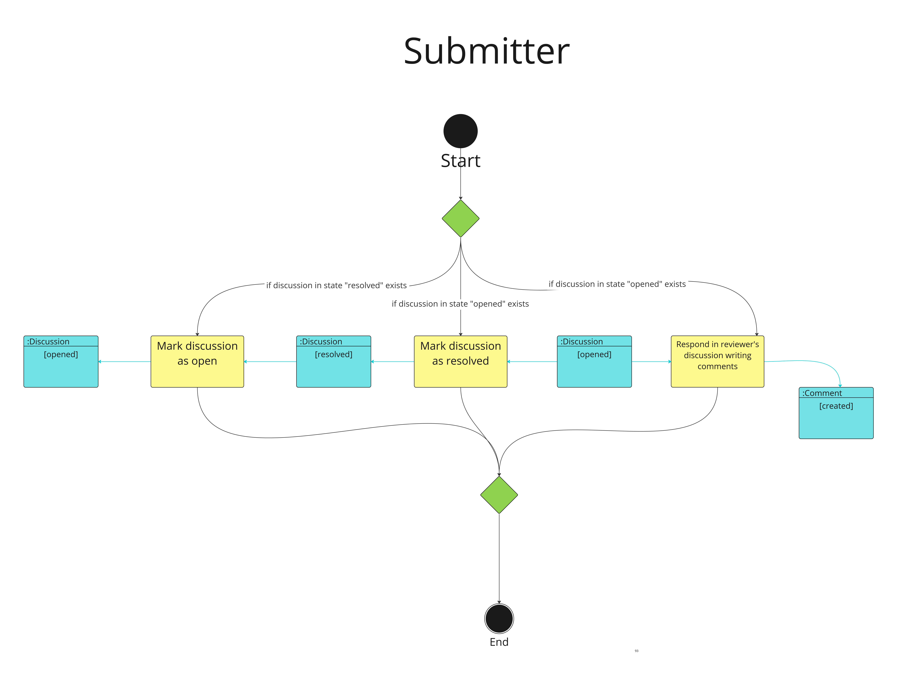

# Business Processes Analysis

# 1. Processes in the Application

Our application will perform a single process, which is detailed below.

## 1.1 Document Review Creation, Conversation, Document Evaluation, and Closure

This process describes the entire lifecycle of a document in our application. The first step is the creation of the document by the project administrator (also referred to as the submitter, who can also be one of the project authors) using a request from the Data Stewardship Wizard (submission of the document to Submission Services, hereinafter referred to as SS). Next, the document is reviewed (Review Document) by reviewers, who add discussions and participate in other reviewers' discussions, providing their opinions or adding final evaluations to the entire document. The submitter can engage in conversations with them (Reacts on Review) until they decide to close the document review (Closes Review). Afterward, no one can interact with the document. The process can start again if the document's submitter decides to reopen the document and continue its evaluation.

### 1.1.1 Reviewer's Interaction with the Document

The reviewer can either add a discussion to the document, respond in another discussion, or provide a rating to the document. After adding a rating, a notification is sent to the document's submitter.

### 1.1.2 Submitter's (Document Author) Interaction with the Document

If there is a discussion in the "opened" state, the document's submitter can add a comment to this thread. This creates a new comment in the "created" state. The thread can also be marked as "resolved," which prevents further discussion and comments. If there is a thread in the "resolved" state, the author can re-mark it as "opened," allowing further discussion in this thread.

