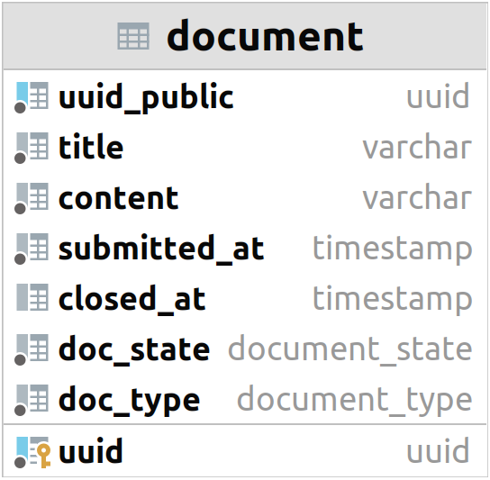

For the second iteration, the database model is still very simple. It contains only a single entity, the document. The user can manipulate documents in a limited way.
To work with the database, this application uses the SQLAlchemy library (https://www.sqlalchemy.org/).

