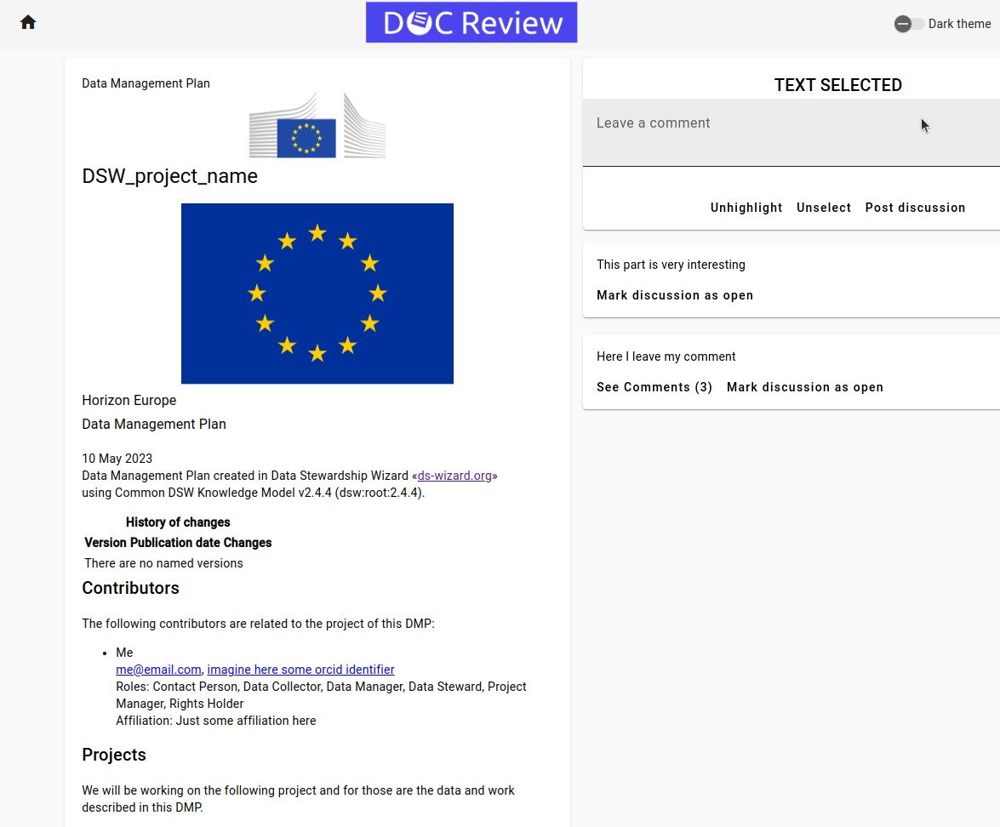

# SP1 - Team Software Product 1

### Backend

I was a backend lead of a software project used for reviewing research documents built and submitted by the Data Stewardship Wizard software product.

I established backend infrastructure with Python, FastAPI, Pydantic, Conda, PostgreSQL database for production, DuckDB in-memory database for testing with PyTest, incorporating code quality tools like MyPy and Pylint and setting code and documentation coverage standards for the whole development.

As the only backend DevOps team member I set up a Docker Compose for faster and easier deployment, and GitLab CI/CD pipelines to run tests and code quality checkers.

As a backend lead, I educated team members who didn't have much experience with Python or didn't have the experience at all, created tasks/issues for them in GitLab, and made the majority of code reviews (TBH almost all of my hours were spent in code reviews and DevOps, I focused on educating team members, giving them opportunities to learn and grow), and integrated a productivity measurement system with TogglTrack to ensure fair work distribution across members.

### Frontend
My part was only negotiation with frontend team on how API should look like for them and implementing their other requirements.

### [Documentation](Documentation)

I participated mainly in creation of UML Diagram, Business Processes Analysis.

## SYNOPSIS
Students gain hands-on experience with the analysis, design, and prototyping of a large-scale software system. Theoretical support is provided in the BIE-SWI course that runs concurrently and that teaches students necessary techniques and principles. Teams consisting of 4-6 students will work on a specific project. The teacher, in the role of the team and project leader, regularly consults with the team (at the seminars) both the formal and material aspects of the software design. The resulting software artefact will be further developed and finished in the BIE-SP2 course.

## COURSE CONTENTS
Students gain hands-on experience with the analysis, design, and prototyping of a large-scale software system. Theoretical support is provided in the BIE-SWI course that runs concurrently and that teaches students necessary techniques and principles. Teams consisting of 4-6 students will work on a specific project. The teacher, in the role of the team and project leader, regularly consults with the team (at the seminars) both the formal and material aspects of the software design. The resulting software artefact will be further developed and finished in the BIE-SP2 course.

## TUTORIALS SYLLABUS
Exercises are dedicated to project consultations.