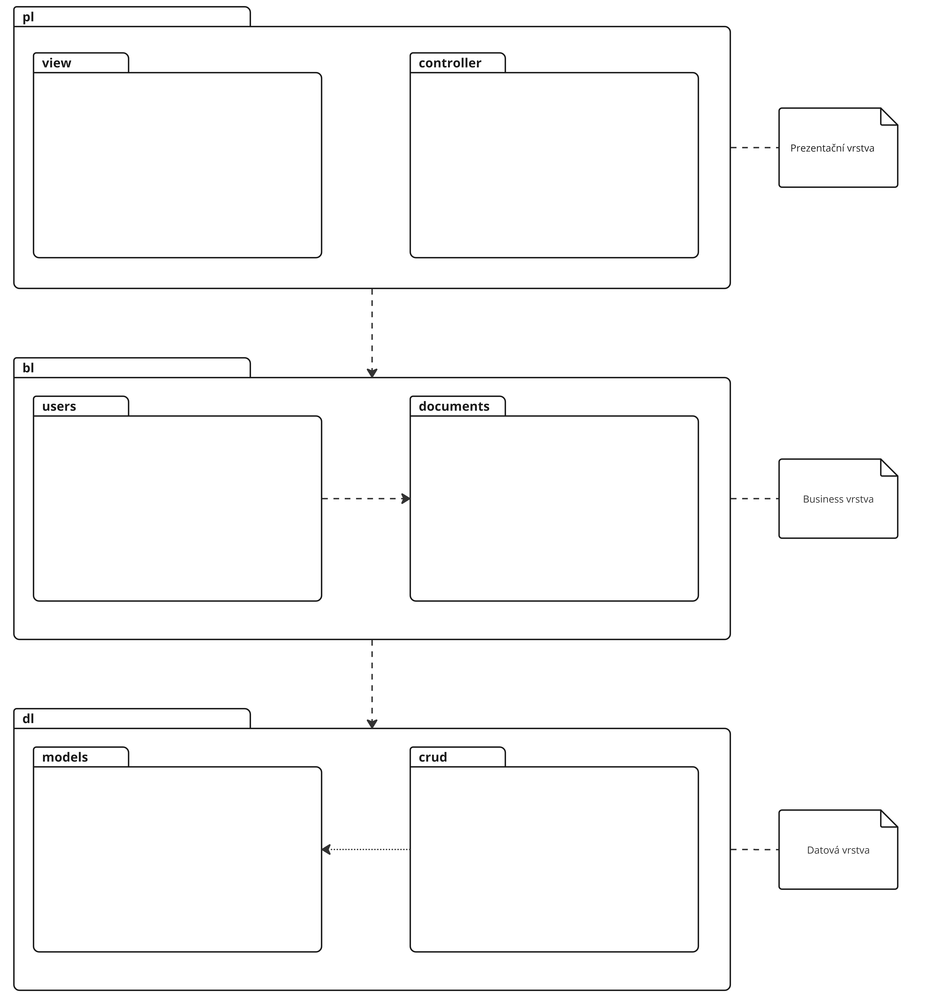

The application architecture is designed as three-layered. The interfaces between the layers will be defined using interfaces. The exact definition of these interfaces will be determined during the implementation of the first version of the application. The interfaces will allow for easy exchange of individual layers. The architecture diagram is shown in the image below.
For the implementation of the application's backend, we use Python and the FastAPI framework. This project primarily utilizes the IoC pattern, which allows linking individual components (classes) in a declarative manner in the application's configuration. This makes it easy to replace some parts with others without modifying the source code, which can be useful, for example, for testing purposes.
Used libraries and frameworks:
- Package binding (IoC) - FastAPI (https://fastapi.tiangolo.com/)
- Data persistence (ORM) - SQLAlchemy (https://www.sqlalchemy.org/)
- User interface (GUI) - Angular (https://angular.io/)
- Testing - pytest (https://docs.pytest.org/en/7.3.x/)
- Package management - conda (https://docs.conda.io/en/latest/)

