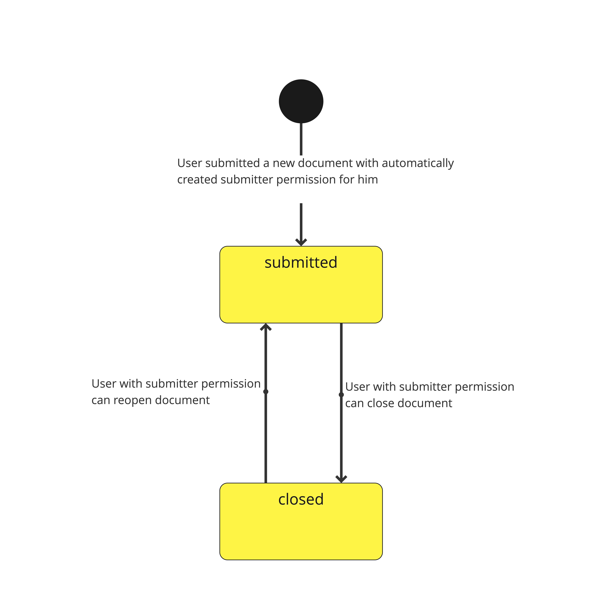
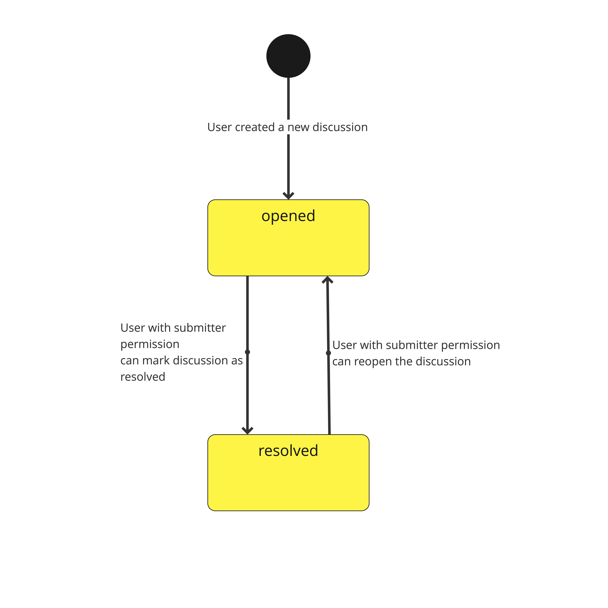
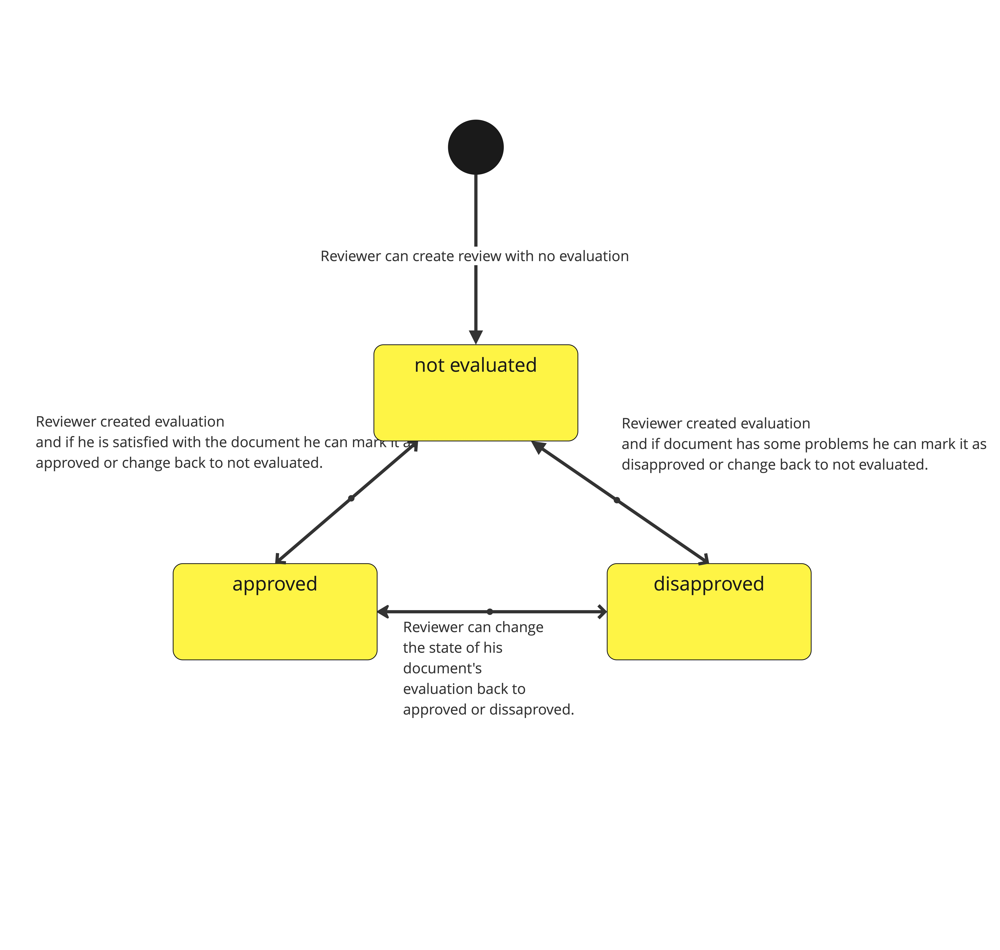

# UML Diagram

# 1. Domain Model

# 2. Description of UML Entities

## 2.1 User

Represents a user account. Can have permissions to documents as a reviewer or submitter. Can create discussions and evaluations of documents, depending on their permission to the documents. Can write comments to discussions or optionally to evaluations. As a submitter, can submit a document.

| Attribute Name | Description |
|----------------|-------------|
| username | User's username |
| password | User's password |
| first_name | User's first name |
| last_name | User's last name |
| email | The contact email of the user to which links for reviewing documents will be sent, and other important information |
| registered_at | The date when the user's account was created |

## 2.2 Document

The submitted document is for review. Can have some evaluations written by users with given permissions to this document. Also can have discussions about its parts, which can be linked to the document passages via crosslinks.

| Attribute Name | Description |
|----------------|-------------|
| title |  |
| content | The contents of the entire document |
| submitted_at | The date when the user with submitter permission submitted the document |
| closed_at | The date when the user with submitter permission closed the document |
| state | The document can have two states: submitted and closed |

## 2.3 Document Permission

Certain user rights indicate the degree of their interaction with the document in our application.

| Attribute Name | Description |
|----------------|-------------|
| role | The user can have the roles of submitter and reviewer |

## 2.4 Discussion

A discussion that reveals a certain problem, the purpose of which is to solve it.

| Attribute Name | Description |
|----------------|-------------|
| crosslink | Crosslink that opens the discussion |
| state | The discussion can have two states: opened and resolved |

## 2.5 Comment

Comments with which the user can conduct a discussion.

| Attribute Name | Description |
|----------------|-------------|
| content | The content of a comment to a specific discussion or evaluation |
| created_at | The date at which the comment was created |

## 2.6 Evaluation

Evaluation of the entire document from some “Reviewer.”

| Attribute Name | Description |
|----------------|-------------|
| state | Evaluation can have three states: approved, disapproved, and not evaluated |
| rating | Rating of the evaluation in numerical value |
| created_at | The date at which the evaluation was created |

# 3. State Diagrams

## 3.1 State of the Document

The document that is being manipulated is the main object in the application, and during the process, it can change its state to:

* submitted - the document is sent to our app for evaluation and receiving feedback. The user who sent this document automatically has submitter permission for the document. The submitter can change the state of the document from closed to submitted if they want to continue the review or accidentally closed the review.
* closed - the document is closed by the submitter if they are satisfied with the review or if it is now irrelevant.

## 3.2 State of the Discussion

A discussion can be opened by any user and its state can be changed by the submitter (user with submitter permission) to:

* opened - the discussion is open and any user can write comments in this discussion. The submitter can also reopen the discussion if they want to continue the discussion or accidentally resolved/closed the discussion.
* resolved - the submitter can mark the discussion as resolved once they are satisfied with the discussion's goal or it is now irrelevant.

## 3.3 State of the Evaluation

Only the reviewer with the permission to evaluate can create an evaluation of the document and set its state to:

* approved - if a user with reviewer permission is satisfied with the document, they approve it.
* disapproved - if a user with reviewer permission isn’t satisfied with the document, they disapprove it.
* not evaluated - a user with reviewer permission may leave the evaluation state as not evaluated.
