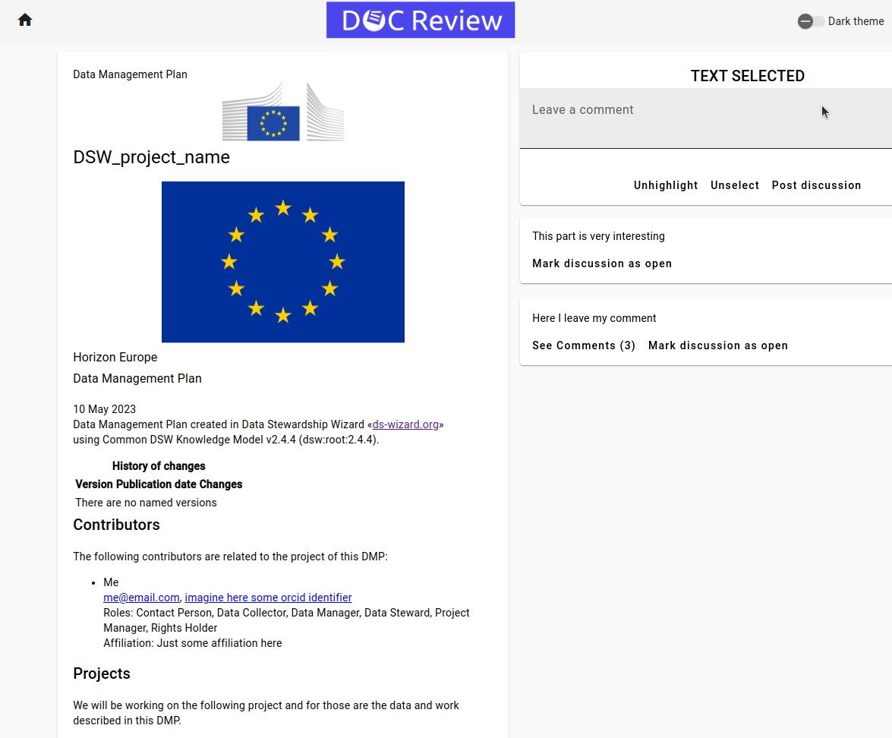
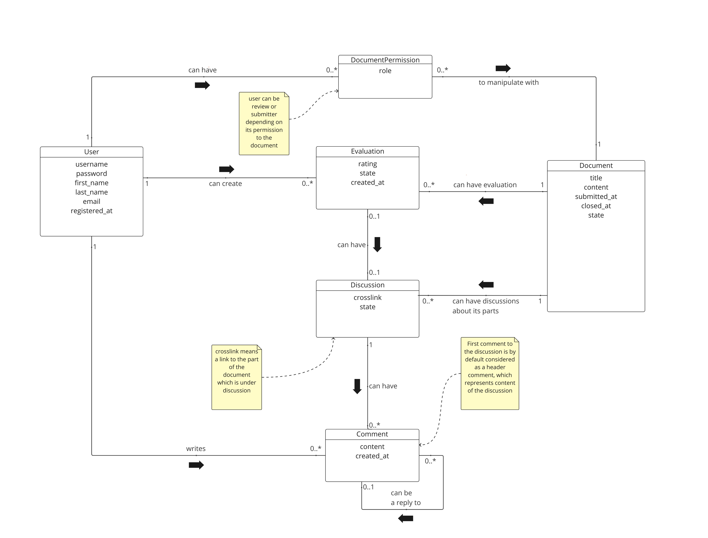
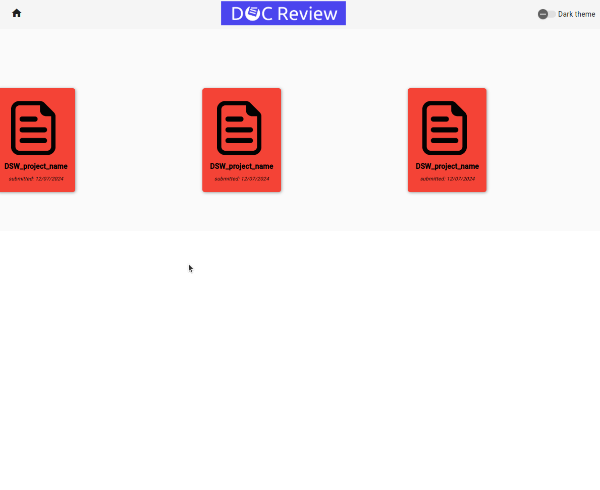
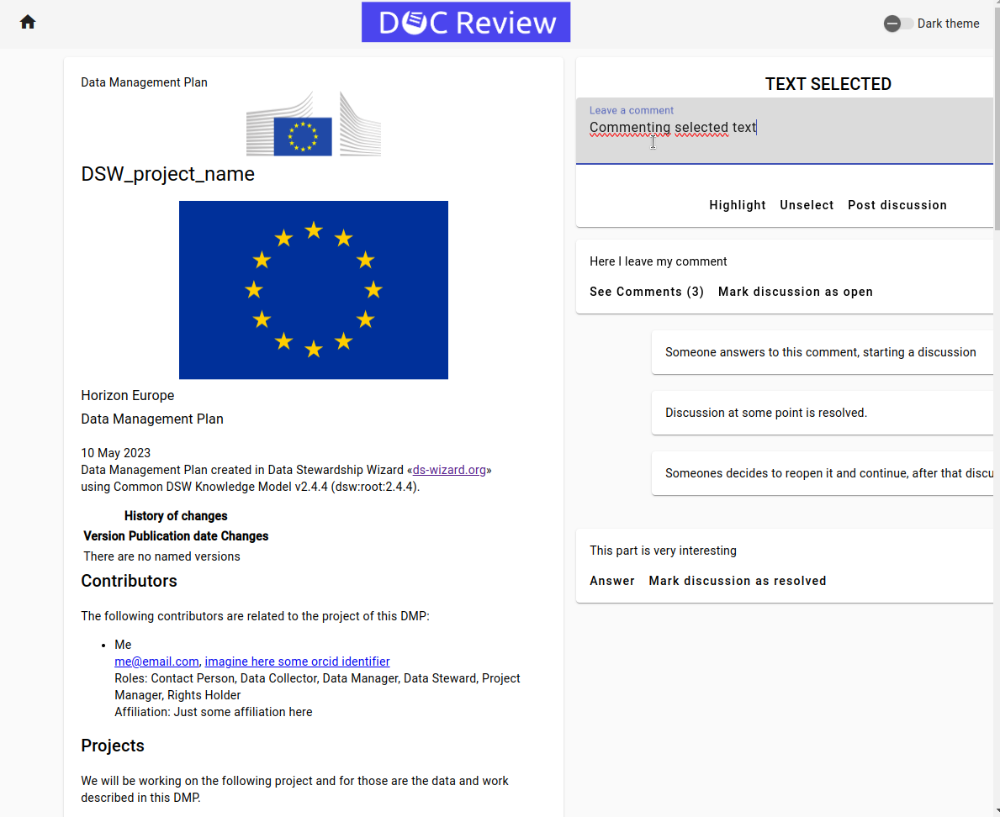
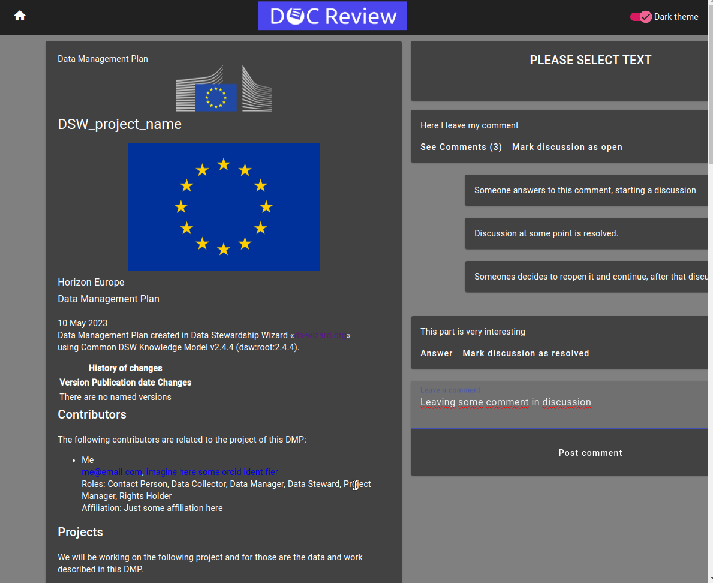

# Wizview - Data Stewardship Review

### [Backend](Backend)

I was a backend lead of a software project used for reviewing research documents built and submitted by the Data Stewardship Wizard software product.

I established backend infrastructure with Python, FastAPI, Pydantic, Conda, PostgreSQL database for production, DuckDB in-memory database for testing with PyTest, incorporating code quality tools like MyPy and Pylint and setting code and documentation coverage standards for the whole development.

As the only backend DevOps team member I set up a Docker Compose for faster and easier deployment, and GitLab CI/CD pipelines to run tests and code quality checkers.

As a backend lead, I educated team members who didn't have much experience with Python or didn't have the experience at all, created tasks/issues for them in GitLab, and made the majority of code reviews (TBH almost all of my hours were spent in code reviews and DevOps, I focused on educating team members, giving them opportunities to learn and grow), and integrated a productivity measurement system with TogglTrack to ensure fair work distribution across members.

Here is the UML diagram:

### [Frontend](Frontend)
My part was only negotiation with frontend team on how API should look like.

Here is how the frontend looks like:

Also see the [wizview_showcase.webm](Documentation%2Fwizview_showcase.webm) video of how the application works.

### [Documentation](Wizview/Documentation) (more visualizations and diagrams)

I participated mainly in creation of UML Diagram, Business Processes Analysis.